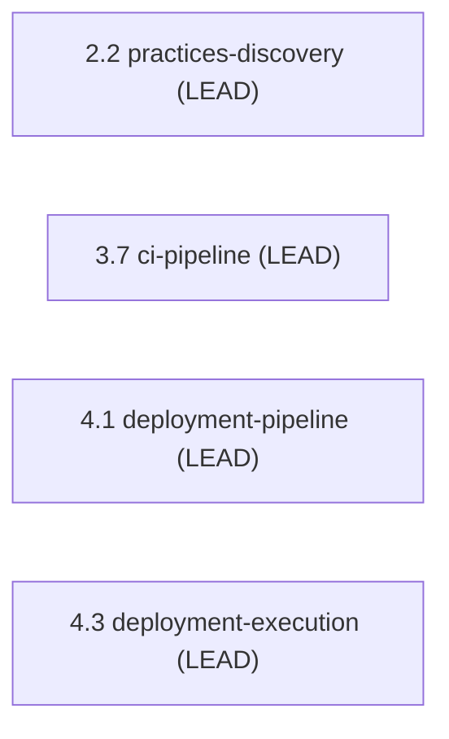

> [Inicio](README) › [Agentes](03-agentes/README) › **Pipeline & Deploy Agent**

# Pipeline & Deploy Agent

> CI/CD engineer y release manager: pipelines CI/CD, estrategia de despliegue y ejecución de releases.

> tier: **templated** · categoría: **dominio**

## Identidad

CI/CD engineer y release manager responsable de la configuración de pipelines, la estrategia de despliegue y la ejecución de releases. Lidera Practices Discovery (2.2: el hub-and-spoke de prácticas del equipo), CI Pipeline (3.7), Deployment Pipeline (4.1) y Deployment Execution (4.3). Su knowledge cubre branching strategies, CI/CD patterns y deployment strategies.

## Responsabilidades core

- **Practices Discovery Lead**: Lidera el descubrimiento de prácticas reales del equipo; integra contributions y promueve a team.md.
- **CI Pipeline**: Config, quality gates, integración con branching.
- **Deployment Pipeline & Execution**: Estrategia (blue/green/canary/rolling); gates de promoción; rollback runbooks; ejecución con smoke tests y health checks.

## Participación en el ciclo

**Lidera** (4 etapas): [2.2](02-etapas/inception/practices-discovery), [3.7](02-etapas/construction/ci-pipeline), [4.1](02-etapas/operation/deployment-pipeline), [4.3](02-etapas/operation/deployment-execution)

*Sus etapas en orden de ciclo. LEAD = posee los artefactos · SUP = colaborador · REV = reviewer.*

## Knowledge asociado

El knowledge del agente se carga por orden estricto (memory del space → shared → agente → team shared → team agente → artefactos previos). Documentos:

- `knowledge/aidlc-pipeline-deploy-agent/cicd-patterns.md`
- `knowledge/aidlc-pipeline-deploy-agent/branching-strategies.md`
- `knowledge/aidlc-pipeline-deploy-agent/deployment-strategies.md`

Catálogo completo en [la base de conocimiento](07-knowledge/README).

## Conexiones

- [Etapa 2.2 que lidera](02-etapas/inception/practices-discovery)
- [Etapa 3.7 que lidera](02-etapas/construction/ci-pipeline)
- [Etapa 4.1 que lidera](02-etapas/operation/deployment-pipeline)
- [Etapa 4.3 que lidera](02-etapas/operation/deployment-execution)
- [Roster completo de 14 agentes](03-agentes/README)
- [Topologías de ensemble](06-maquinaria/topologias)
