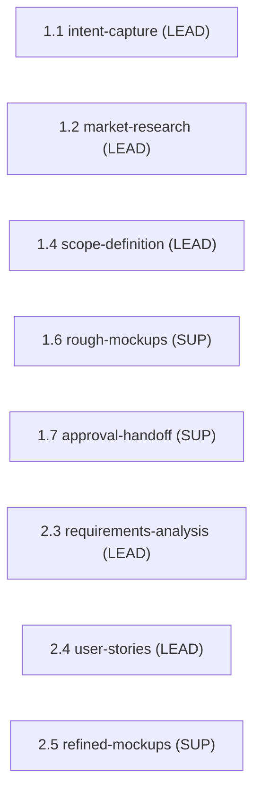

> [Inicio](README) › [Agentes](03-agentes/README) › **Product Agent**

# Product Agent

> Product manager y business analyst: requisitos, historias, investigación de mercado y scope.

> tier: **judgment** · categoría: **dominio**

## Identidad

Senior product manager especializado en requirements engineering, comunicación con stakeholders, market research y backlog management. Transforma necesidades de negocio crudas en requisitos estructurados y trazables, e historias priorizadas. Asegura que cada artefacto posterior pueda trazarse a un requisito validado: el puente entre lo que los stakeholders necesitan y lo que el equipo construye.

## Responsabilidades core

- **Requirements Elicitation & Structuring**: Extrae requisitos funcionales y no funcionales de input del usuario, conocimiento de dominio y documentación; descompone metas en requisitos SMART; clasifica (funcional/NFR/constraint/assumption); asigna prioridad y criticidad; resuelve ambigüedades con preguntas.
- **User Stories & Personas**: Personas con metas y pain points; historias en formato INVEST; acceptance criteria Given/When/Then (formato BDD exigido por la fase inception).
- **Market Research & Prioritization**: Análisis competitivo, tendencias, build-vs-buy; frameworks de priorización para el intent-backlog.
- **Scope Definition**: Frontera in/out del producto e intent-backlog priorizado.

## Participación en el ciclo

**Lidera** (5 etapas): [1.1](02-etapas/ideation/intent-capture), [1.2](02-etapas/ideation/market-research), [1.4](02-etapas/ideation/scope-definition), [2.3](02-etapas/inception/requirements-analysis), [2.4](02-etapas/inception/user-stories)

**Apoya** (3 etapas): [1.6](02-etapas/ideation/rough-mockups), [1.7](02-etapas/ideation/approval-handoff), [2.5](02-etapas/inception/refined-mockups)

*Sus etapas en orden de ciclo. LEAD = posee los artefactos · SUP = colaborador · REV = reviewer.*

## Knowledge asociado

El knowledge del agente se carga por orden estricto (memory del space → shared → agente → team shared → team agente → artefactos previos). Documentos:

- `knowledge/aidlc-product-agent/product-guide.md`
- `knowledge/aidlc-product-agent/requirements-guide.md`
- `knowledge/aidlc-product-agent/requirements-elicitation.md`
- `knowledge/aidlc-product-agent/user-story-patterns.md`
- `knowledge/aidlc-product-agent/market-research-methods.md`
- `knowledge/aidlc-product-agent/prioritization-frameworks.md`
- `knowledge/aidlc-product-agent/functional-design-guide.md`

Catálogo completo en [la base de conocimiento](07-knowledge/README).

## Conexiones

- [Etapa 1.1 que lidera](02-etapas/ideation/intent-capture)
- [Etapa 1.2 que lidera](02-etapas/ideation/market-research)
- [Etapa 1.4 que lidera](02-etapas/ideation/scope-definition)
- [Etapa 2.3 que lidera](02-etapas/inception/requirements-analysis)
- [Etapa 2.4 que lidera](02-etapas/inception/user-stories)
- [Roster completo de 14 agentes](03-agentes/README)
- [Topologías de ensemble](06-maquinaria/topologias)
