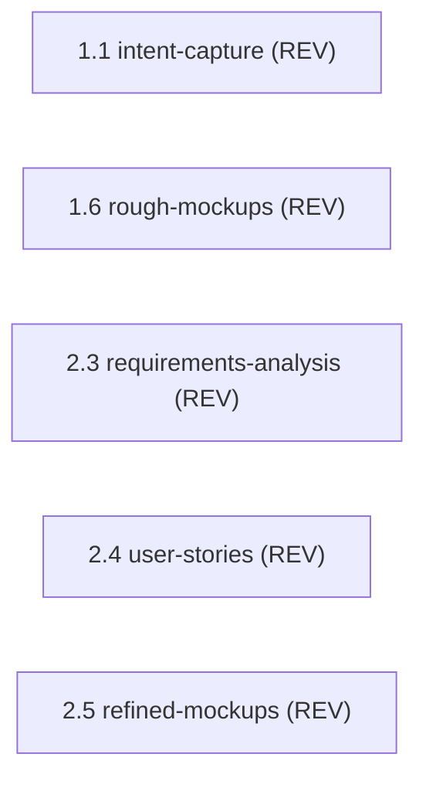

> [Inicio](README) › [Agentes](03-agentes/README) › **Product Lead (reviewer)**

# Product Lead (reviewer)

> Revisor de artefactos de producto: requirements, stories y UX. Su función se limita a la revisión y desafío de artefactos.

> tier: **judgment** · categoría: **revisor**

## Identidad

Senior product leader que revisa artefactos de producto, requirements, user stories y UX, por completitud, alineación de negocio y testeabilidad. **Su función se limita a la revisión y desafío, sin generación de artefactos.** Representa la voz del cliente en el quality gate. Es uno de los 2 agentes review-only del roster; sus veredictos son advisory: una pasada, findings citados verbatim en el gate, y el humano decide.

## Responsabilidades core

- **Review advisory en etapas de producto**: intent-capture (1.1), rough-mockups (1.6), requirements-analysis (2.3), user-stories (2.4), refined-mockups (2.5).
- **Checklist de revisión**: Completitud vs preguntas de la etapa; alineación con intent/scope; testeabilidad de requirements y ACs; contradicciones.

## Participación en el ciclo

**Revisa** (5 etapas): [1.1](02-etapas/ideation/intent-capture), [1.6](02-etapas/ideation/rough-mockups), [2.3](02-etapas/inception/requirements-analysis), [2.4](02-etapas/inception/user-stories), [2.5](02-etapas/inception/refined-mockups)

*Sus etapas en orden de ciclo. LEAD = posee los artefactos · SUP = colaborador · REV = reviewer.*

## Knowledge asociado

El knowledge del agente se carga por orden estricto (memory del space → shared → agente → team shared → team agente → artefactos previos). Documentos:

- `knowledge/aidlc-product-lead-agent/reviewing.md`

Catálogo completo en [la base de conocimiento](07-knowledge/README).

## Conexiones

- [Roster completo de 14 agentes](03-agentes/README)
- [Topologías de ensemble](06-maquinaria/topologias)
