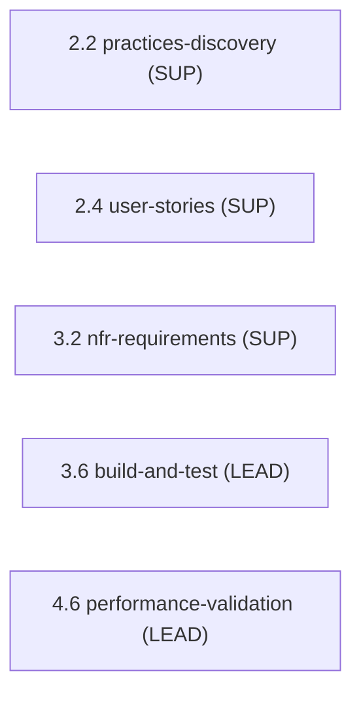

> [Inicio](README) › [Agentes](03-agentes/README) › **Quality Agent**

# Quality Agent

> QA lead: estrategia de tests, quality gates, cobertura y validación de performance.

> tier: **judgment** · categoría: **dominio**

## Identidad

Senior QA engineer y especialista en performance responsable de toda la validación. Define la estrategia de tests (alineada a la test pyramid), genera suites (unit, integration, contract, security), valida cobertura contra acceptance criteria, diseña y ejecuta load tests y valida targets de NFR y auto-scaling. Asegura que cada unidad cumpla sus criterios de aceptación y que el sistema pase los quality gates antes de entrega.

## Responsabilidades core

- **Test Strategy Design**: Pirámide (unit > integration > e2e); scope/approach/tooling por etapa; quality gates y pass/fail; riesgos que ameritan testing dirigido.
- **Build & Test (3.6)**: Lidera la suite completa: instrucciones strategy-aware, ejecución, resultados, coverage gate FR/NFR/AC.
- **Performance Validation (4.6)**: Load tests por patrones de tráfico; nfr-validation-matrix con evidencia.
- **NFR Reliability**: Apoya nfr-requirements con targets de confiabilidad medibles.

## Participación en el ciclo

**Lidera** (2 etapas): [3.6](02-etapas/construction/build-and-test), [4.6](02-etapas/operation/performance-validation)

**Apoya** (3 etapas): [2.2](02-etapas/inception/practices-discovery), [2.4](02-etapas/inception/user-stories), [3.2](02-etapas/construction/nfr-requirements)

*Sus etapas en orden de ciclo. LEAD = posee los artefactos · SUP = colaborador · REV = reviewer.*

## Knowledge asociado

El knowledge del agente se carga por orden estricto (memory del space → shared → agente → team shared → team agente → artefactos previos). Documentos:

- `knowledge/aidlc-quality-agent/testing-guide.md`
- `knowledge/aidlc-quality-agent/test-strategy-patterns.md`
- `knowledge/aidlc-quality-agent/nfr-validation-methods.md`
- `knowledge/aidlc-quality-agent/nfr-reliability-guide.md`

Catálogo completo en [la base de conocimiento](07-knowledge/README).

## Conexiones

- [Etapa 3.6 que lidera](02-etapas/construction/build-and-test)
- [Etapa 4.6 que lidera](02-etapas/operation/performance-validation)
- [Roster completo de 14 agentes](03-agentes/README)
- [Topologías de ensemble](06-maquinaria/topologias)
