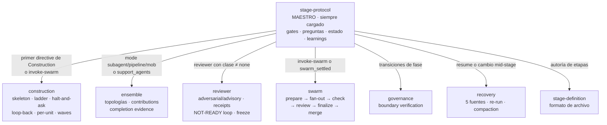

> [Inicio](README) › **Protocolos**

# 04 · El sistema de protocolos

Los protocolos son el **contrato de ejecución** de AI-DLC: qué debe hacer el conductor en cada situación, de forma no negociable. Hay un protocolo maestro (obligatorio para TODAS las etapas) y **7 módulos condicionales** que se cargan según el modo, la fase o el evento.

## Matriz de carga condicional

| Módulo | Se carga cuando | Líneas | Trata |
|---|---|---|---|
| [stage-protocol](04-protocolos/protocolo-stage) | Siempre (referenciado por cada stage file) | 1.242 | Voice contract, gates §1, completion §2, preguntas §3, estado §4, personas §5, depth §8, validación §10, learnings §13, reuso de artefactos |
| [construction](04-protocolos/protocolo-construction) | Primer directive de Construction + cada `invoke-swarm` | 499 | Bolt gates, walking skeleton, ladder, halt-and-ask, loop-back 3.6→3.5, per-unit iteration, waves, plan contract 12b |
| [ensemble](04-protocolos/protocolo-ensemble) | mode = subagent/pipeline/mob o hay support_agents | 176 | 4 topologías, return summary, contribution files, context budget, failure recovery |
| [reviewer](04-protocolos/protocolo-reviewer) | Directive lleva reviewer con clase efectiva ≠ none | 343 | Request→dispatch→verdict, adversarial vs advisory, receipts, NOT-READY loop, review brief, dispositions |
| [swarm](04-protocolos/protocolo-swarm) | Cada `invoke-swarm` y re-entradas settled | 84 | Prepare/fan-out/check/review/finalize/merge, settled re-entry, source landing |
| [governance](04-protocolos/protocolo-governance) | Transiciones de fase (fin de ideation/inception/construction) | 32 | Phase boundary verification + PHASE_VERIFIED |
| [recovery](04-protocolos/protocolo-recovery) | Session resume o cambio detectado mid-stage | 274 | 5 fuentes de reconstrucción, resume, re-run, compaction, state corrupto, artefacto faltante, severidades, cambios |
| [stage-definition](04-protocolos/definicion-de-etapa) | Al autorar/validar etapas | 230 | Frontmatter autorado vs computado, body compartments, compile + drift invariant |

## Por qué protocolos (y no "buen juicio")

La premisa del repo: **NO EMERGENT BEHAVIOR**. Un agente LLM con libertad de menús inventa navegación, resume respuestas del usuario (rompiendo la trazabilidad), o se salta el ritual de learnings "porque no había nada". El protocolo elimina ese espacio: menús de opciones fijas, campos obligatorios, herramientas dueñas de cada transición, y hooks que bloquean las desviaciones. El costo es rigidez deliberada a cambio de verificabilidad.

## Reading order sugerido

1. [stage-protocol](04-protocolos/protocolo-stage): el 80% de la mecánica diaria vive ahí.
2. [ciclo-de-gate](06-maquinaria/ciclo-de-gate) (maquinaria): el flujo aprobación/rechazo en detalle.
3. [ensemble](04-protocolos/protocolo-ensemble) + [topologías](06-maquinaria/topologias): cómo colaboran los agentes.
4. [construction](04-protocolos/protocolo-construction): la fase con más ceremonia.
5. El resto según necesidad: recovery (algo se rompió), reviewer (gate con review), swarm (autonomía).
