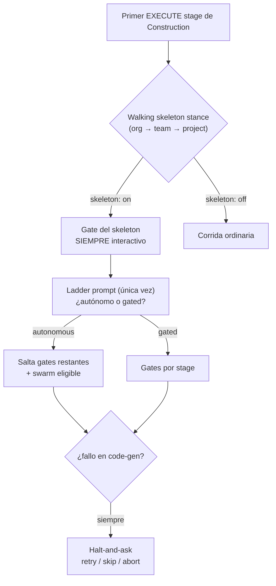
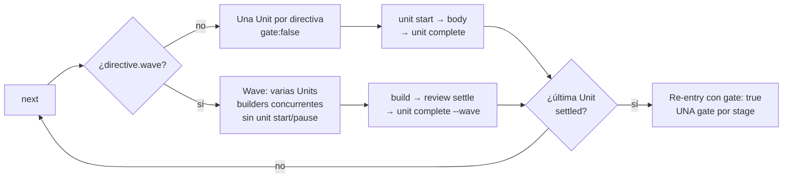

> [Inicio](README) › [Protocolos](04-protocolos/README) › **construction**

# Protocolo de Construction

Módulo que se carga en el primer directive de Construction de la sesión y en cada `invoke-swarm`. Gobierna la fase más maquinada del ciclo: ceremonias de Bolt, iteración per-unit, waves, autonomía, y el loop-back de fallos.

## Walking skeleton + ladder + halt-and-ask

- **Walking skeleton**: el primer in-scope Construction EXECUTE stage presenta gate SIEMPRE (cubre esa etapa en las Units settled, no un Bolt combinado). La stance se resuelve `org.md → team.md → project.md` (la más específica no-vacía gana); `skeleton: off` en el scope lo apaga.
- **Ladder**: exactamente UN prompt tras aprobar el skeleton: "Continue autonomously / Gate every Bolt". Se graba con `aidlc-bolt.ts set-autonomy` (emite `AUTONOMY_MODE_SET`). Es set-autonomy-owned, como los gates son report-owned. En resume con mode unset y skeleton ya `[x]`, el ladder se re-dispara.
- **Halt-and-ask**: fallo de Code Generation detiene SIEMPRE, en cualquier modo (solo el loop-back de 3.6 es la otra parada). Solo Unit: retry (re-run en el MISMO worktree) / skip (`[S]`, worktree preservado) / abort (Construction se detiene; resume posible). Batch parcial: esperar los Tasks, preservar los exitosos, `BOLT_FAILED` con `Succeeded=[...]`.

## Loop-back Build-and-Test (3.6 → 3.5)

Cuando 3.6 diagnostica que el root cause está en el **código generado o la elección de code-gen** (no en su propio scaffolding), el flujo puede volver a 3.5 y reparar. Es la excepción sancionada a "completa la etapa antes de saltar": **la etapa fallida queda deliberadamente in-flight** (sin gate, learnings diferidos al run que pase).

- **El ledger es el bound**: `## Loop-Back Log` en test-results.md, append-only, `### Loop-back N` por entrada. Máximo **3 por intent**. Un jump dirigido por humano NO cuenta.
- **Plan approval se re-pregunta**: el jump crea una nueva época de directiva. Se blanquea el `[Answer]:` y se corre la secuencia completa de Plan Approval antes de generar. "Retry with fix" autoriza el jump, NO el plan.
- **Procedimiento autónomo**: append al ledger → jump vía engine (`next --stage code-generation` → ejecutar el comando `aidlc-jump.ts execute` que el engine IMPRIMA, jamás compuesto a mano) → re-entry con fix + Artifact Re-use determinista (Modify objetivo / Keep resto / Modify build-and-test) → reviews frescos por unidad → gate auto-aprobado con `--user-input "Autonomous loop-back N per construction protocol module"`.
- **Halt-and-ask variantes**: con fix candidato → Retry with fix / Accept failure / Abort (cada descripción con impacto estimado). Sin fix identificable → sin "Retry with fix" (inventarlo sería el give-up no estimado del otro lado).

## Iteración per-unit (engine-driven)

- Los 5 stages per-unit (3.1–3.5) iteran una directiva por Unit en orden de build; `report --result approved` se NIEGA mientras quede una Unit unsettled.
- **Receipts de lifecycle**: `unit start/complete` (verifica artefactos como archivos regulares en disco), `unit pause` (checkpoint con reason + next-action; la Unit pausada hard-stopa el loop hasta `unit resume`). Con floors por intent-attempt (`Run floor`) que invalidan receipts viejos tras jumps/rechazos.
- **Waves** (opcional, stage-major): batches del DAG curado con entradas por Unit, builders concurrentes; code-generation NO es wave-eligible (escribe el workspace compartido y hard-stopea por Plan Approval).
- **Unit-major** (opt-in en delivery-planning): cada Unit cruza sus 4 designs + code-gen antes de la siguiente. El primer código funcional aterriza tras UNA Unit. El swarm nunca dispara bajo unit-major.
- **Team-owned units** (opt-in): `Unit Ownership: team` + ritmo de gates `per-stage` o `unit-end`; tabla `## Unit Progress` derivada del DAG (jamás editable a mano); claims git-nativos (`aidlc unit claim/participate/release`), merge-back con pin + gate + land transaccional (estrategia merge obligatoria, squash/rebase se rechazan).

## §12b · Autonomous Code Generation Plan Contract

Un `invoke-swarm` cambia dónde corre la generación, no si hay planning: por cada Unit se ejecuta 3.5 Parte 1 hasta Plan Approval en el workspace principal (plan + testing contract renderizado + fingerprint), STOP por cada aprobación pendiente, y solo con todas las approvals corrientes corre `prepare`. Worker briefs arrancan exactamente con `AIDLC-UNIT: <unit>` y `AIDLC-TESTING-CONTRACT: <sha>`; el worker produce `source-manifest.json` en el worktree antes del review in-Bolt. El guard rechaza workers con marker faltante o distinto del plan aprobado.

> Conexión: [swarm](04-protocolos/protocolo-swarm) · [reviewer](04-protocolos/protocolo-reviewer) · [ciclos-de-vida](06-maquinaria/ciclos-de-vida)
