> [Inicio](README) › [Protocolos](04-protocolos/README) › **ensemble**

# Protocolo de ensemble (topologías multi-agente)

Módulo que se carga cuando `directive.mode` es `subagent`, `pipeline` o `mob`, o cuando la etapa declara support_agents. Define cómo participan los supports. La topología la gobierna el `mode` del directive, nunca la mera presencia de support_agents.

## El modelo de escritura

```mermaid
flowchart TD
    subgraph INLINE["inline · 29 etapas"]
        C1["Conductor adopta<br/>la voz del lead"]
    end
    subgraph SUB["subagent (hub-and-spoke) · 2 etapas"]
        C2["Conductor"] --> L["Lead (Task)"]
        L --> DR["Draft"]
        DR --> S1["Support 1 (Task paralelo, ciego)"]
        DR --> S2["Support 2 (Task paralelo, ciego)"]
        S1 --> F1["contribución"]
        S2 --> F2["contribución"]
        F1 --> INT["Lead integra"]
        F2 --> INT
    end
    subgraph PIPE["pipeline (cadena) · 1 etapa"]
        C3["Conductor"] --> Lk1["Link 1: developer scan"]
        Lk1 --> Lk2["Link 2: architect synthesis"]
        Lk2 --> ART["artefactos completos"]
        Lk1 -.-> RC["receipt por link"]
    end
    subgraph MOB["mob (mesh, rondas) · 1 etapa"]
        C4["Conductor"] --> LD["Lead redacta"]
        LD --> P1["Support A"] 
        LD --> P2["Support B"]
        LD --> P3["Support C"]
        P1 & P2 & P3 --> TRI["Lead integra + triage"]
        TRI --> R2["Ronda 2: solo objetores"]
        TRI --> GT["Gate con disenso citado"]
    end
```

En toda topología despachada: **cada quien escribe su propio trabajo**. Cada support escribe un **contribution file** en `<record>/<fase>/<stage>/contributions/<agent-slug>.md` con primera línea identity-marker obligatoria; **el lead solo edita los `produces[]`** de la etapa. Los roles son constantes: lead posee los artifacts, supports colaboran como participantes reales, y el reviewer verifica después desde fuera. **El orquestador es el bus**: cada intercambio es un dispatch suyo y un retorno que él lleva. Los agentes no se invocan entre sí.



## Las 4 topologías

| Topología | Mecánica | Evidencia de completitud | Etapas |
|---|---|---|---|
| **inline** | El conductor adopta la persona del lead; supports = voces; sin contributions | — | 29 |
| **subagent** | Lead despachado; supports EN PARALELO contra el draft del lead, **mutuamente ciegos**; lead final integra | Contribution files con identity marker | practices-discovery, code-generation |
| **pipeline** | Los links co-autoresan: cada link ve todo lo upstream y AVANZA el artefacto; el último lo deja completo; sin contributions | `PIPELINE_LINK_COMPLETED` por repo por link (current-attempt) | reverse-engineering |
| **mob** | Lead drafts; TODOS los supports en paralelo; integración + objection triage; disenso mantenido citado VERBATIM en el gate | Contribution files + positions | user-stories |

En un harness sin paralelismo, los dispatches corren secuenciales con briefs sin cambios. La invariante es el contrato quién-ve-qué, no la concurrencia.

## Objection triage (mob)

- **Judgment calls** → al HUMANO mid-stage como pregunta estructurada.
- **Disputas de conocimiento** → **ronda 2**: solo los objetores actualizan SU contribution file.
- **Disenso mantenido tras triage** → citado verbatim en el completion summary del gate (en autonomous: al gate del batch final).

## Return summary de subagentes (formato obligatorio)

```markdown
## Subagent Summary: [Stage Name]
### Produced
- [path]: [descripción breve]
### Key Decisions
- [decisión]: [razón]
### Issues / Concerns
- [problemas/riesgos] o "None"
### Next Steps
- [qué hace el orquestador con esto]
```

El orquestador debe leer el summary antes de continuar; si Issues no está vacío, lo presenta al usuario; si Produced trae menos archivos que los esperados, investiga antes de completar.

## Contribution file (formato)

```markdown
**Collaborator:** [agent-slug]

## Contribution
[contenido sustantivo: hallazgos, adiciones, correcciones]

## Positions
- AGREE: [aspecto respaldado] — [razón]
- OBJECT: [aspecto disputado] — [razón]
```

Primera línea verbatim obligatoria. El engine la verifica como evidencia. Nunca escriben fuera de `contributions/`.

## Context budget (anti-overflow)

- Solo los artefactos de la Unit actual (no todas).
- Para CONSTRUCTION subagents: resumen 1-2 líneas por artefacto de inception con su path. No embedir contenido completo.
- Siempre: instrucciones específicas + paths de estado/artefactos. La persona y knowledge los carga el harness. No pegarlos en el brief.
- Knowledge grande: nombrar paths relevantes; que el despachado los lea por sus recursos.

## Failure recovery de subagentes

Fallo de Task (timeout/error/truncado): **retry una vez** con prompt reducido (resúmenes en vez de contenido). Si vuelve a fallar: decirlo claramente y ofrecer "Run it here" (hacer el trabajo en esta conversación) / "Skip and revisit" (dejar la etapa inacabada y seguir). Log con formato Error.

## Completion evidence (determinista)

En mob o subagent-with-supports, el engine **rechaza el gate y la completitud** mientras falte algún contribution file declarado o su identity marker. En pipeline: cada repo escaneado necesita cada link declarado (receipts current-attempt; un `ARTIFACT_REUSED keep` repo-scoped exime ese repo). Escape hatch de recuperación: `AIDLC_DISABLE_ENSEMBLE_EVIDENCE=1`, solo para recuperar una etapa legítimamente corrida cuya evidencia se perdió en upgrade/interrupción.

## Lo que el usuario oye

Las handoffs pasan dentro de la etapa, fuera del alcance del narration del directive. Por eso el módulo escribe las frases: "Let me bring in the [trade] on [the specific question]", "The [first trade] takes a look first, then the [next trade] builds on what comes back", "Getting the [trade] and [trade] to weigh in on this together". Integración: **SAY nothing**. El trabajo de integrar no es un evento.
