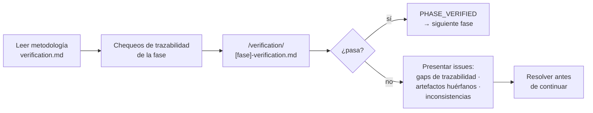

> [Inicio](README) › [Protocolos](04-protocolos/README) › **governance**

# Protocolo de governance (phase boundary verification)

El módulo más corto del sistema: en cada transición de fase, fin de Ideation, Inception y Construction, corre verificación de trazabilidad antes de que la siguiente fase empiece. La transición Initialization→Ideation no tiene chequeo (es bootstrap).

## Cuándo y dónde

| Frontera | Transición | Chequeos |
|---|---|---|
| **Ideation → Inception** | approval-handoff → reverse-engineering | Intent capturado · scope definido · viabilidad confirmada · iniciativa aprobada |
| **Inception → Construction** | delivery-planning → functional-design | Requirements ↔ stories: toda story traza · arquitectura cubre todas las stories · units definidas · delivery plan aprobado |
| **Construction → Operation** | ci-pipeline → deployment-pipeline | Todas las units built+tested · CI configurado · infra diseñada · código traza a diseño · cobertura vs ACs |

Disparadores: tras aprobarse la última etapa de la fase, antes de la primera de la siguiente, y on-demand vía `/aidlc --status`.

## Proceso

Las categorías de fallo: **missing traceability links** (un requisito sin diseño), **orphaned artifacts** (un diseño sin requisito) e **inconsistencias** entre outputs de fases. El detalle de cada check vive en [verification.md](07-knowledge/verificacion): trazabilidad elemento a elemento con IDs estables.

## Nota de diseño

El boundary check es un control **feed-forward** al estilo Fowler: cuando los issues se repiten, se mejoran los controles. De ahí que capturar correcciones como reglas durables sea el Learnings Ritual (§13) y no un flujo separado de guardrails. Este archivo solo cubre la verificación de trazabilidad de frontera.
