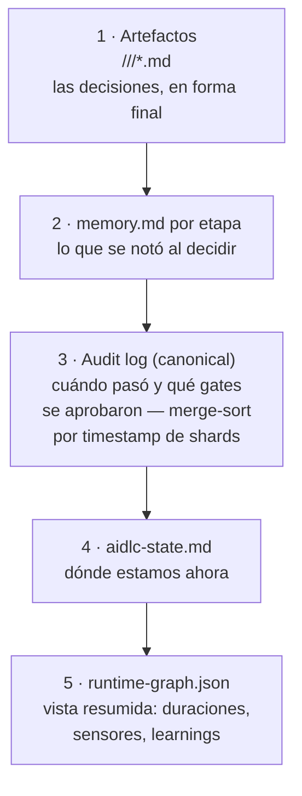

> [Inicio](README) › [Protocolos](04-protocolos/README) › **recovery**

# Protocolo de recovery & change handling

Se carga al reanudar sesión o cuando se detecta un cambio mid-stage. Su tesis: **la recuperación es una propiedad emergente del data plane**: todo lo importante ya está en disco; solo hay que reconstruir el contexto leyendo las fuentes correctas en el orden correcto.

## Las 5 fuentes (orden de lectura)

Outputs primero, notas segundo, timeline tercero, cursor cuarto, resumen al final, como un humano retomando el trabajo a medio hacer de otro. La recovery no puede recuperar el buffer de conversación: re-orientarse de estas fuentes, no recrear el chat. Ante desacuerdo entre fuentes, el audit log manda.

## Session resume

Si `aidlc-state.md` existe: leer stages `[x]`, current/next, artefactos previos → ofrecer resume desde la última etapa incompleta. Carga de contexto según fase (INITIALIZATION: nada; IDEATION: artefactos + guardrails; INception RE: CodeKB + ideation; practices: draft + interview + contributions…).

**Detección de loop-back logueado-pero-no-saltado**: si test-results.md tiene `## Loop-Back Log` con fix planeado pero el audit no muestra el `STAGE_JUMPED` correspondiente, la sesión murió entre log y jump. Re-ejecutar el jump (no re-diagnosticar). El contador de resume es el conteo del ledger, nunca cero.

## Los escenarios de recuperación

| Escenario | Procedimiento |
|---|---|
| **Stage re-run** (cambios tras aprobación) | Re-leer stage file, cargar artefactos previos como contexto, re-ejecutar sobrescribiendo, nuevo completion |
| **Context compaction** | El hook PreCompact valida el estado y escribe breadcrumb `.aidlc-recovery.md`; al reanudar, comparar con aidlc-state.md para detectar corrupción |
| **State corrupto** | Backup `.bak` → reconstruir desde evidencia de artefactos (CodeKB → RE completa; requirements/ → esa etapa; código que matchea stories → code-gen) → cursor = primera etapa sin evidencia → contarlo al usuario |
| **Artefacto faltante** | ¿El productor está SKIP en este scope? → ausencia BY DESIGN, usar el fallback documentado del stage body (o el humano lo provee). ¿Está `[x]` pero sin archivos? → ofrecer re-run o provisión manual. ¿No está complete? → correr la etapa |
| **Inputs contradictorios** | Citar ambos, NO elegir interpretación, preguntar cuál manda, actualizar el artefacto overridden, log de la resolución |

## Severidades y escalación

| Severidad | Descripción | Acción |
|---|---|---|
| **Critical** | El workflow no puede continuar (state corrupto, artefactos críticos faltantes) | Parar y preguntar inmediatamente |
| **High** | El output puede estar incorrecto (inputs contradictorios, respuestas incompletas) | Parar y preguntar |
| **Medium** | Calidad posiblemente reducida (respuestas vagas, contexto parcial) | Intentar resolver; si no, preguntar |
| **Low** | Cosmético/no bloqueante (formato, naming) | Resolver en silencio y auditar |

## Change handling (§7)

- **Material nuevo mid-stage** (código de referencia, specs, sample data): se registra como **evidencia/input de la etapa actual, sin efecto sobre el routing**. La entrega de material no inicia un avance de etapa.
- **Cambios menores** (dentro de la etapa): integrar al artefacto en curso.
- **Cambios mayores** (afectan etapas previas): archivar, evaluar impacto, re-ejecutar las etapas afectadas.
- **Cambios de scope** (nuevos requisitos): responder con las preguntas de scope, o recomponer el workflow (composer/recompose).
- **Cambios de Unit / arquitectura**: impact analysis con las dependencias del DAG; los receipts/reviews afectados se invalidan.

## Audit de recovery

Formatos especializados: `## Error:` (severity/type/description/cause/resolution/impact), `## Recovery:` (issue/steps/outcome/artifacts), `## Change Request:` (request/current state/impact/confirmation/action), siempre append-only al shard del clone.
