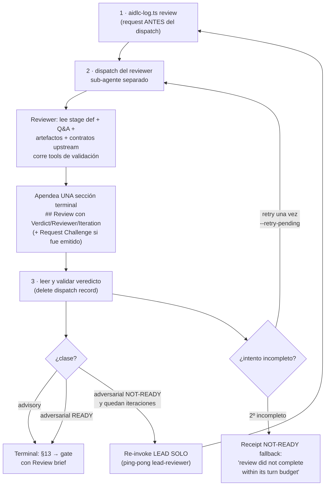

> [Inicio](README) › [Protocolos](04-protocolos/README) › **reviewer**

# Protocolo de reviewer (§12a)

Se carga cuando un directive nombra reviewer con clase efectiva ≠ `none`. Define el flujo completo: request → dispatch → veredicto → receipts, y las dos clases de review.

## Las dos clases

| Clase | Mecánica | Default en | Iteraciones |
|---|---|---|---|
| **advisory** | UNA pasada como soporte de decisión del gate humano. Sea cual sea el verdict: NO se re-invoca al lead ni se re-corre al reviewer — receipt terminal, §13, y findings citados VERBATIM en el gate para que el humano triage. La única excepción: la recovery de stale-receipt. | ideation/inception (prosa, readiness = juicio humano) | 1 |
| **adversarial** | Loop refute-and-repair hasta `reviewer_max_iterations` con fixes del lead entre pasadas. Findings con evidencia machine-checkable; la opinión es suggestion, no ground para NOT-READY. | construction (machine-checkable, los loops convergen) | 2 (default) |

**El contrato adversarial**: *refute, don't confirm*: el reviewer asume que hay defectos y los caza; READY es el veredicto al que falla en llegar tras intentar romper el artefacto. La clase efectiva la resuelve el engine (declaración del stage menos `review_cap` del scope menos override `--review` por run).

## Flujo (1 request → 2 ejecución → 3 veredicto)

## Reglas críticas

- **Request-first**: ANTES de cada dispatch (y antes de tocar un `## Review` existente) se graba `aidlc-log.ts review`. El request amarra los bytes exactos de los artefactos declarados + fingerprint de fuente; mientras está unmatched, gate y completitud quedan bloqueados.
- **`review_artifact`**: el UNO output markdown dueño del apéndice de review. Ninguna posición del produces-list lo redefine. Un `## Review` previo se BORRA (restaurando los bytes pre-apéndice) antes de re-disparar: un review cortado no deja veredicto viejo disfrazado de cobertura nueva.
- **Lo que se pasa**: stage file, Q&A file, todos los produces, `Prior findings (carry IDs forward)` en re-dispatch (el reviewer PRESERVA IDs y actualiza estados), consumes resueltos (paths only), tools de validación. **No se pasa**: memory.md ni plan/reasoning files. El reviewer forma juicio independiente.
- **Read-scope per-unit**: la Unidad actual + contratos compartidos; PROHIBIDO leer `construction/<otra-unit>/` (hook reviewer-scope lo bloquea; `REVIEWER_SCOPE_BLOCKED`) salvo spot-check de un integration point explícito (un solo archivo dueño, resuelto por contratos).
- **Receipt terminal**: tras grabar el veredicto NO se escribe ningún produces[] hasta el gate. El hook review-freeze bloquea writes (`REVIEW_FREEZE_BLOCKED`). Si algo invalida el receipt: exactamente UN recovery review al siguiente ordinal (`Recovery: stale-receipt`), y si ese también se invalida: no más reviews; solo un Request Changes humano resetea el intento.
- **Suggestions no se aplican**: van citadas verbatim al gate. Son input del gate, no defecto. No cambian el orden de opciones (Approve primero).
- **Dispositions en el gate**: Approve mapea findings New/Unresolved → `Accepted risk` (en la fila GATE_APPROVED); un rechazo explícito del humano se registra con `--reject-finding "<artifact>#R-NN=<reason exacto>"` (jamás inferido de feedback genérico).

## El Review brief (gate con reviewer)

Herramienta obligatoria ANTES de la pregunta de aprobación: `aidlc-review-brief.ts review --stage <slug> --why <first|revision|stale>`: imprime stage, outcome en lenguaje llano, razón path-specific, tabla de findings hidratada y el efecto de ambas decisiones, **sin exponer el token de veredicto**. En el fallback de intento incompleto: `--fallback-finding "review did not complete within its turn budget"`.

## Precondición hard del engine (gate y completitud)

Todo `gate-start`, `revise`, `approve`, `advance`, `finalize` y `complete-workflow` se NIEGAN en una etapa con reviewer declarado hasta que exista un `REVIEW_COMPLETED` fresco, por unidad en las per-unit. Un restart, jump relevante, rechazo o write posterior invalida receipts (per-unit writes solo esa unidad). La condición es hard en que el review OCURRIÓ, soft en el veredicto: un NOT-READY tras agotar iteraciones igual llega al gate humano. **Autonomous Construction no está exento**: cada Unit del swarm se revisa en su worktree tras converger y antes de finalize.

## Lo que el reviewer NO hace

No modifica el artefacto más allá de apendar `## Review`; no se comunica con el builder (todo media el orquestador); no accede a plan.md ni memory.md del builder; no bloquea el workflow (el humano siempre tiene la última palabra en el gate); no dispara en stages sin reviewer.

## Lo que el usuario oye

"Let me have the [reviewer's trade] check this over before you see it" · "Fair points came back, let me tighten [the thing] and re-check" (una vez por ronda) · "I had this checked [N] times and [N] concerns are still open. They are in the artifact and I will flag them at the decision below" · "Those changes are in. Let me get them checked over again before you look." El usuario oye "una segunda mirada". Jamás "el reviewer devolvió NOT-READY".
