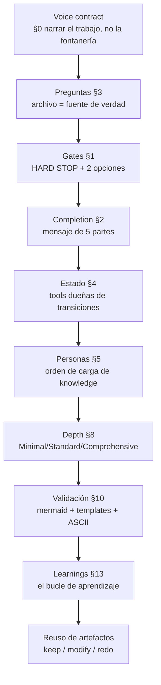

> [Inicio](README) › [Protocolos](04-protocolos/README) › **stage-protocol (maestro)**

# stage-protocol: el protocolo maestro

**MANDATORY: All stages follow this protocol. Referenced by every stage file.** Es el contrato que toda etapa obedece: cómo habla el conductor, cómo se abre un gate, cómo se preguntan cosas, cómo se rastrea el estado y cómo se aprende. Organizado en 14 secciones.

## §0 · Voice contract: hablar al usuario

El interlocutor es un developer construyendo su proyecto; no vino a aprender las entrañas del framework. Reglas: narrar el trabajo ("estoy viendo qué partes del proceso encajan"), jamás la fontanería ("el engine está resolviendo la scope grid" ✗). Vocabulario reservado (interno, prohibido en chat): engine, directive, dispatch, conductor, harness, verb, scope grid, steering, forwarding loop, mint, swarm, entropy, ARS. En los gates, tres cosas simples en orden: qué se produjo, qué debe mirar el usuario, y qué pasa tras aprobar.

## §1 · Approval gates

- **HARD STOP**: al presentar un gate, el conductor TERMINA su turno y espera la respuesta explícita. No se llama a ninguna tool antes de que el humano responda.
- **NO EMERGENT BEHAVIOR**: Construction/Operation = menús de exactamente 2 opciones (Approve / Request Changes). Solo ideation/inception pueden ofrecer una 3ª (recuperar etapa saltada). Dos excepciones sancionadas: revision escape hatch y el loop-back de Build-and-Test.
- **Respuestas no coincidentes**: si el usuario responde fuera de las opciones, se cita brevemente su respuesta, se re-presenta la misma pregunta con todas las opciones, y se termina el turno. Sin escribir receipts.
- **Escape hatch**: tras 3 "Request Changes" en la misma etapa, aparece **Accept as-is** (archiva y avanza).
- Sensores blocking: si el reporte de gate se niega por findings, el gate no está abierto. Opciones "Fix findings / Override blocking sensors" (autonomous jamás ofrece override).

## §2 · Completion messages (5 partes)

0. **Entrar al gate**: render announcement+summary → learnings ritual como turno propio → `report awaiting-approval` (en silencio: nunca narrar este bookkeeping) → pregunta de aprobación.
1. **Announcement**: `# [Stage Name] Complete`.
2. **Summary**: bullets factuales + tabla de artefactos (5-10 líneas) para decidir sin abrir el archivo. En la primera completion del session: mostrar depth y test strategy.
3. **Review + approval**: si hay reviewer, el review brief ANTES del path y la pregunta.
4. **Progress update**: formato exacto `Progress: [N]/33 overall | [phase-N]/[phase-total] [Phase] stages complete. Next: [Next Stage]`. O in-scope cuando el scope recorta: `Progress: 5/8 in-scope stages complete (7/33 overall)`.

## §3 · Question format

**El archivo de preguntas es la fuente de verdad.** Flujo: crear `<slug>-questions.md` (opciones A-E, siempre `X. Other`, tags `[Answer]:` en blanco) → ofrecer 3 modos (Guide me / I'll edit the file / Chat) → responder por lotes escribiendo de vuelta → **confirmación consolidada** persistida (Looks correct / Request changes) antes de generar.

- **Depth-aware**: Minimal ~2-4, Standard ~5-8, Comprehensive ~8-12+ preguntas (guías, no caps duros).
- **Nunca re-preguntar**: chequeo recursivo de TODO `*-questions.md` previo + audit shards antes de añadir una pregunta.
- **Preguntas auto-explicativas**: expandir todo identificador (`FR3` ✗ → "el requisito de exportar en 5 min (FR3)" ✓); una línea de contexto; phrasing concreto.
- **Answer analysis OBLIGATORIO**: vaguedades ("depende", "mix of"), contradicciones (scope vs riesgo, offline-first vs real-time), missing details → follow-ups antes de proceder.
- **Anti-sobreconfianza**: ante "whatever you think" → re-encuadrar a prioridades del usuario.

## §4 · State tracking

- Lifecycle SOLO vía `aidlc-orchestrate.ts report` (awaiting-approval / approved / rejected / revised / skipped); jamás verbs de `aidlc-state.ts` a mano ni checkboxes editados.
- Task transitions con `[slug]` en activeForm (el hook sincroniza estado automáticamente).
- Checkboxes: `[ ]` pendiente, `[-]` in-progress, `[?]` awaiting, `[R]` revising, `[x]` completada, `[S]` saltada (excluida de conteos).
- Preguntas no-gate: par `aidlc-log.ts decision` (antes) + `answer` (después). También es la señal de human-wait para el Stop hook.
- **Ritual atómico**: iniciada una etapa, todos sus pasos corren (preguntas → artefacto → reviewer → learnings → gate). "Saltar a la etapa X" salta etapas INTERMEDIAS, nunca el ritual de la destino.
- **Autonomía nunca inferida**: "go with recommended" vale para esa etapa, no crea regla permanente.

## §5 · Agent persona loading

Orden de knowledge: 1. memory del space (org/team/project) → 2. shared del framework → 3. del agente → 4. team shared → 5. team del agente → 6. artefactos previos. En inline: el conductor lee las personas; en subagent: el harness las carga (jamás inyectarlas en el prompt). Los delegados jamás tocan el lifecycle. Devuelven artefacto/veredicto, y el conductor decide.

## §8 · Depth guidance

| Depth | Preguntas | Requisitos | Domain Design | Contract Design |
|---|---|---|---|---|
| Minimal | 2-4 | 5-10, NFR mínimo | 1 diagrama, nota de ADRs | usualmente skip |
| Standard | 5-8 | 15-30 con ACs | componentes + interacciones, 2-3 ADRs | 1 spec por boundary/API |
| Comprehensive | 8-12+ | 30+ ACs detalladas | multi-capa, 5+ ADRs con alternativas | versionado + error budgets |

Overrides: flag `--depth`, en scope confirmation, o en cualquier gate. Test strategy independiente (`--test-strategy`): Minimal = modelo **Nyquist** (1 test por requisito + happy-path floor); Standard = 5-8 por componente (75/20/5); Comprehensive = 10-15 con todos los tipos.

## §10 · Content validation

Mermaid: validar sintaxis, nodos declarados, y **fallback textual** en comentario bajo cada diagrama. Templates: resolución override-before-default (team → framework → prose). ASCII: solo `+ - | ^ v < > / \` con padding uniforme. Quedan prohibidos los box-drawing Unicode. Escapado: `|` en tablas, comillas en labels mermaid.

## §13 · Learnings ritual (el corazón del self-learning)

Entre completion y gate, en cada etapa con gate humano:

1. **Diario**: el conductor mantiene `<record>/<fase>/<stage>/memory.md` con 4 headings: Interpretations / Deviations / Tradeoffs / Open questions. Bullets timestamped.
2. **Surface**: `aidlc-learnings.ts surface` parsea el diario y emite candidatos (verbatim, sin filtrar) + open questions **parqueados** (nunca se instalan).
3. **Pregunta humana**: una opción por candidato (con destino de routing) + siempre "Anything to add? / Nothing to add". END TURN. El `QUESTION_ANSWERED` debe preceder al `STAGE_AWAITING_APPROVAL`.
4. **Conflict check**: la práctica propuesta se contrasta contra `org.md` (misma sección). Contradicción → el usuario revisa, salta o escala.
5. **Persist**: `aidlc-learnings.ts persist` escribe bajo lock con dedup por hash de contenido: learning → línea de práctica en `project.md`/`team.md` (heading routed por fit: Testing Posture / Forbidden / Corrections); sensor → manifest + append al `sensors:` del stage (la única mutación sancionada de stage files).

Los stage files son inmutables por diseño: (1) los upgrades del framework conflictarían con ediciones de runtime; (2) el mismo stage corre en muchos proyectos. Mutarlo deriva la metodología en direcciones incompatibles. El harness (rules, learnings, sensors) compone; el body no.

## Reuso de artefactos (backward jump / redo)

Al encontrar artefactos existentes: **Keep** (aceptar y saltar generación) / **Modify** (como contexto de partida, walk through de preguntas) / **Redo from scratch** (sobrescribir). Receipt `ARTIFACT_REUSED` por `aidlc-state.ts reuse-artifact`. En loop-back autónomo las decisiones son deterministas: Modify las units objetivo, Keep el resto, Modify build-and-test (Redo prohibido. Borraría el Loop-Back Log).

## §14 · Sensor imports

El frontmatter `sensors:` es la lista completa de checks importados. `fire_on: gate` corre al entrar/re-entrar el gate (advisory emite, blocking exige pass verificado); `fire_on: write` corre durante writes coincidentes (advisory en esta release). Findings a `<record>/.aidlc-sensors/<stage>/<sensor>-<id>.md`.

> Ver también: [ciclo-de-gate](06-maquinaria/ciclo-de-gate) y [memoria-y-aprendizaje](06-maquinaria/memoria-y-aprendizaje).
