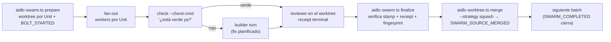

> [Inicio](README) › [Protocolos](04-protocolos/README) › **swarm**

# Protocolo de swarm

Módulo que se carga en cada `invoke-swarm` y en re-entradas `swarm_settled`. Define la ejecución autónoma paralela de code-generation: una Unit por worktree, con referee determinista.

## El ciclo del swarm

- **prepare** verifica el plan aprobado (plan + test instructions + contract embebido + answer + fingerprint + epoch + receipt humano) antes de crear cualquier worktree. Un input stale (memory/scope/test-strategy/project-type) reabre la aprobación en vez de cambiar la ejecución en silencio.
- **check primero**: tras prepare, correr check en TODAS las units antes de gastar builder turns. Una Unit ya verde no necesita builder, pero sí necesita review fresco antes de `finalize --claimed`.
- **finalize** verifica el stamp de prepare del intento, el receipt terminal del reviewer y el fingerprint del artefacto antes de aceptar el claim.
- **merge** post-finalize: `aidlc-worktree.ts merge --slug <bolt> --target <base> --strategy squash` por cada fila converged. Recupera repo/intent de la autoridad durable, consume el Source Commit inmutable, deshabilita hooks ambientales y emite `SWARM_SOURCE_MERGED`. La convergencia moderna no avanza el batch hasta que esa fila existe. Un fallo pre-merge preserva el worktree (resolver y reintentar el mismo merge); si el mensaje trae `merge-succeeded:<sha>` pero falta el evento, es cleanup-only (reintentar sin re-aplicar fuente).

## Reglas de re-entrada y attempt

- **`swarm_settled: true`** es un directive gate-only tras converger cada Unit: NO correr body, ni builders, ni reviewer de nuevo. Solo learnings ritual + gate + report. Autocontenida para que una sesión fresca no repita reviews.
- **Run floor**: cada `SWARM_UNIT_CONVERGED` debe matchear el token de boundary del intento actual (`<event>:<timestamp>#<ordinal>` sobre workflow start, jump, rejection y stage start). Las filas de intentos previos no cuentan y todas las units se re-despachan por defecto.
- **Stale worktrees**: un crash o halt-and-ask mid-swarm deja worktrees/branches. `prepare` hard-erroa en colisión: descartar los stale antes de un prepare nuevo, jamás adoptarlos.
- **El cheap path** (asumir el código del intento previo en la base) solo es válido si el merge git de ese intento completó; si no, todos los checks salen rojos y degrada a full re-dispatch. Nunca hay claim silencioso de units no construidas.
- **Halts en swarm**: `BOLT_FAILED` con `--slug` para correlación con halt-and-ask; retry re-run en el mismo worktree.
- Recovery receipt invalidado en Unit autónoma: halt antes de finalize. No `--claimed`, no merge; decisión humana Retry/Abort por el seam halt-and-ask. En Retry: abortar el Bolt viejo y re-prepare con los argumentos originales (worktree y `BOLT_STARTED` frescos resetean la contabilidad). **Jamás sintetizar `GATE_REJECTED`**.

## El settle gate

Tras converger el batch, el engine re-emite con `gate: true`. Bajo autonomía el conductor auto-aprueba ese settle (la aprobación humana original del plan cubre el batch), y el learnings ritual corre como turno propio. Los worktrees se mergean por fila converged; `SWARM_COMPLETED` cierra el batch y habilita el siguiente.

> Conexión: [protocolo construction](04-protocolos/protocolo-construction) §12b (plan contract) · [ciclos-de-vida](06-maquinaria/ciclos-de-vida) · [protocolo reviewer](04-protocolos/protocolo-reviewer) (receipts por Unit)
