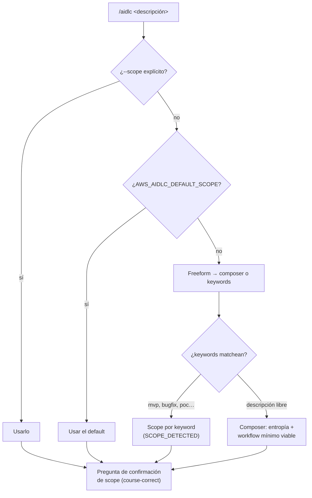

> [Inicio](README) › **Scopes**

# 05 · Scopes: 11 formas de correr el mismo ciclo

Un **scope** es una rejilla EXECUTE/SKIP sobre las 33 etapas. La misma espina dorsal corre de enterprise (33/33, regulado) a poc (8/33, desechable). El scope fija depth por defecto, keywords de detección automática, review_cap y la ceremonia walking-skeleton; el usuario lo puede cambiar en cualquier gate.

## Cómo se elige el scope



La confirmación de scope es deliberada: un dispatch silencioso al scope incorrecto invalida artefactos y consume tiempo, por lo que el engine siempre pregunta antes de comprometer.

## Tabla comparativa

| Scope | Depth | Test Strat. | Review cap | Skeleton | Keywords | Ejecuta |
|---|---|---|---|---|---|---|
| [enterprise](05-scopes/enterprise) | Comprehensive | depth | — | on | — | **33/33** |
| [feature](05-scopes/feature) | Standard | depth | — | on | — (fallback freeform) | **33/33** |
| [classic](05-scopes/classic) | Standard | depth | advisory | on | — | 26/33 |
| [workshop](05-scopes/workshop) | Standard | **Minimal** | advisory | on | workshop, lab, training | 26/33 |
| [mvp](05-scopes/mvp) | Standard | depth | — | on | mvp, minimum viable | 23/33 |
| [infra](05-scopes/infra) | Standard | depth | — | on | infrastructure, deploy, infra | 13/33 |
| [refactor](05-scopes/refactor) | Minimal | depth | — | off | refactor, clean up, simplify | 10/33 |
| [express](05-scopes/express) | Minimal | depth | **none** | off | express, lightweight | 10/33 |
| [security-patch](05-scopes/security-patch) | Minimal | depth | — | off | security, CVE, vulnerability, patch | 10/33 |
| [bugfix](05-scopes/bugfix) | Minimal | depth | advisory | off | fix, bug, broken | 9/33 |
| [poc](05-scopes/poc) | Minimal | depth | advisory | on | proof of concept, prototype, poc, spike | 8/33 |

## La rejilla completa (autoritativa)

E = EXECUTE, · = SKIP. Los números son los de las 33 etapas.

| Scope | 0.1–0.3 | 1.1 | 1.2 | 1.3 | 1.4 | 1.5 | 1.6 | 1.7 | 2.1 | 2.2 | 2.3 | 2.4 | 2.5 | 2.6 | 2.7 | 2.8 | 2.9 | 3.1 | 3.2 | 3.3 | 3.4 | 3.5 | 3.6 | 3.7 | 4.1 | 4.2 | 4.3 | 4.4 | 4.5 | 4.6 | 4.7 |
|---|---|---|---|---|---|---|---|---|---|---|---|---|---|---|---|---|---|---|---|---|---|---|---|---|---|---|---|---|---|---|---|
| enterprise | EEE | E | E | E | E | E | E | E | E | E | E | E | E | E | E | E | E | E | E | E | E | E | E | E | E | E | E | E | E | E | E |
| feature | EEE | E | E | E | E | E | E | E | E | E | E | E | E | E | E | E | E | E | E | E | E | E | E | E | E | E | E | E | E | E | E |
| classic | EEE | · | · | · | · | · | · | · | E | E | E | E | E | E | E | E | E | E | E | E | E | E | E | E | E | E | E | E | E | E | E |
| workshop | EEE | · | · | · | · | · | · | · | E | E | E | E | E | E | E | E | E | E | E | E | E | E | E | E | E | E | E | E | E | E | E |
| mvp | EEE | E | · | E | E | · | E | · | E | E | E | E | E | E | E | E | E | E | E | E | E | E | E | E | · | · | · | · | · | · | · |
| infra | EEE | · | · | · | · | · | · | · | · | E | E | · | · | · | · | · | · | · | E | E | E | · | · | E | E | E | E | E | · | · | · |
| refactor | EEE | · | · | · | · | · | · | · | E | · | E | · | · | · | · | · | · | E | · | · | · | E | E | · | E | · | E | · | · | · | · |
| express | EEE | · | · | · | · | · | · | · | E | · | E | · | · | · | · | · | · | · | · | · | · | E | E | · | E | · | E | E | · | · | · |
| security-patch | EEE | · | · | · | · | · | · | · | E | · | E | · | · | · | · | · | · | · | E | · | · | E | E | · | E | · | E | · | · | · | · |
| bugfix | EEE | · | · | · | · | · | · | · | E | · | E | · | · | · | · | · | · | · | · | · | · | E | E | · | E | · | E | · | · | · | · |
| poc | EEE | E | · | · | · | · | · | · | E | · | E | · | · | · | · | · | · | · | · | · | · | E | E | · | · | · | · | · | · | · | · |

## Los tres niveles de depth y la test strategy

| Depth | Preguntas/etapa | Requisitos | Tests |
|---|---|---|---|
| **Minimal** | ~2-4 | 5-10, esenciales | Nyquist: 1 test/requisito + happy-path floor (~5-15) |
| **Standard** | ~5-8 | 15-30 con ACs | 5-8/componente, pirámide 75/20/5 |
| **Comprehensive** | ~8-12+ | 30+ profundas | 10-15/componente, todos los tipos |

Test strategy separada del depth (`--test-strategy`): p.ej. workshop corre depth Standard con testing Minimal; un bugfix puede pedir testing Comprehensive para una regresión crítica. Los floors por scope son aditivos: mvp/enterprise/feature/infra/classic añaden 80% line-coverage + CI; bugfix/security-patch añaden regresión dirigida + suite existente verde.

## Overrides en caliente

```
/aidlc --scope bugfix --depth comprehensive
/aidlc --depth standard --test-strategy minimal
/aidlc --test-strategy minimal        # mid-workflow
```
En cualquier approval gate se puede pedir cambiar scope, depth o test strategy (eventos SCOPE_CHANGED / DEPTH_CHANGED / TEST_STRATEGY_CHANGED auditable).

## El compositor adaptativo

`/aidlc compose`: el [Composer Agent](03-agentes/aidlc-composer-agent) no matchea keywords: estima entropía (ambigüedad del intent, incertidumbre estructural del codebase, entropía de verificación, riesgo, supuestos sin resolver) y compone el workflow mínimo viable: la secuencia más pequeña que transforma el intent en cambio verificado de forma segura y económica. Cada etapa añadida debe tener valor esperado positivo. Tres momentos: Front (proyecto nuevo), Report (input de escaneo tipo SonarQube), Recompose (re-forma el sufijo de un workflow en curso, `RECOMPOSED`).
