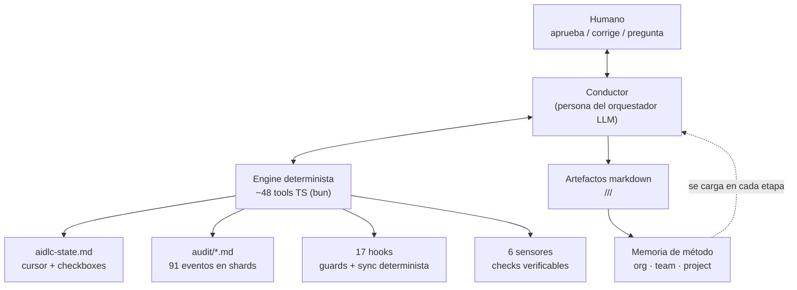

> [Inicio](README) › **Maquinaria**

# 06 · Maquinaria — el motor de ejecución

Bajo la conversación hay una máquina. Esta área desglosa el **runtime** de AI-DLC: quién decide qué, qué se registra, qué se verifica y qué se aprende.

## El split de responsabilidades

| Capa | Qué posee | Ejemplos |
|---|---|---|
| **Engine (determinista)** | Lifecycle, auditoría, enrutamiento, verificación | `report`, `advance`, `approve`, `skip`, receipts, guards |
| **Conductor (LLM)** | La calidad de ejecución dentro de la movida | Personas, preguntas, artefactos, learnings, narración |
| **Hooks (deterministas)** | Refuerzo del protocolo en el harness | freeze, scope, plan-guard, sync, audit-log |
| **Humano** | Toda decisión material | Gates, overrides, correcciones → reglas |

La regla es: **el engine decide qué etapa sigue; el conductor es dueño de qué tan bien corre la etapa asignada**. El forwarding loop: directiva → una movida → reporte → siguiente directiva.

## Páginas de esta área

| Página | Contenido |
|---|---|
| [El conductor](06-maquinaria/conductor) | El oficio: personas, preguntas, diario, Keep/Modify/Redo |
| [Ciclo de gate](06-maquinaria/ciclo-de-gate) | awaiting→approved/rejected→revised, escape hatch, sensores blocking |
| [Sistema de estado](06-maquinaria/sistema-de-estado) | aidlc-state.md completo: secciones, checkboxes, Unit Progress |
| [Auditoría](06-maquinaria/auditoria) | Los 91 eventos / 22 categorías, reglas de append, receipts |
| [Memoria y aprendizaje](06-maquinaria/memoria-y-aprendizaje) | org/team/project, learnings ritual, routing tree |
| [Sensores](06-maquinaria/sensores) | Los 6 checks, fire_on, advisory vs blocking |
| [Hooks](06-maquinaria/hooks) | Los 17 hooks y qué refuerza cada uno |
| [Topologías](06-maquinaria/topologias) | inline/subagent/pipeline/mob + evidencia de completitud |
| [Ciclos de vida](06-maquinaria/ciclos-de-vida) | Units, Bolts, worktrees, swarm, ladder, autonomía, loop-back |
