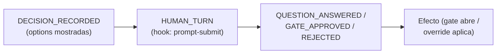

> [Inicio](README) › [Maquinaria](06-maquinaria/README) › **Auditoría**

# Auditoría: 91 eventos, 22 categorías

AI-DLC registra un **audit trail estructurado para trazabilidad enterprise**: 91 tipos de evento en 22 categorías, cada uno con sus campos y su **emisor dueño**. La regla: cada evento lo emite su herramienta/hook por el camino de librería, nunca a mano por el LLM.

## Estructura del trail

- **Shards por clone**: `<record>/audit/<host>-<clone>.md`, append-only. Al reanudar: glob de `audit/*.md` + merge-sort por timestamp (shards iguales-timestamp son causalmente desordenados).
- **Campos base**: `## Evento:` + Timestamp ISO + campos específicos (Stage, Artifacts, Verdict, Bolt, Unit, Run floor…).
- **User Input COMPLETO y SIN MODIFICAR**: requisito de compliance: el matiz puede estar en el wording exacto; parafrasear destruye evidencia.

## Las 22 categorías (mapa de los 91)

| Categoría | Eventos clave | Emisor dueño |
|---|---|---|
| **Fases** | PHASE_VERIFIED, PHASE_SKIPPED | state.advance / complete-workflow, utility.intent-create |
| **Ciclo de etapa** | STAGE_AWAITING_APPROVAL, STAGE_REVISING, STAGE_JUMPED, STAGE_SKIPPED, STAGE_COMPLETED | state.gate-start/revise/approve, jump.execute |
| **Sesión** | SESSION_STARTED/RESUMED/COMPACTED/ENDED, RECOVERY_COMPLETED | hooks session-*, validate-state |
| **Presencia humana** | HUMAN_TURN | hook record-human-turn (prompt-submit + widget) |
| **Workspace** | WORKSPACE_SCAFFOLDED/SCANNED/INITIALISED | utility.handleInit |
| **Config** | SCOPE_CHANGED/DETECTED, DEPTH/TEST_STRATEGY/REVIEW_CLASS_CHANGED, PLUGIN_SELECTION_CHANGED, RECOMPOSED | utility |
| **Decisiones** | DECISION_RECORDED, QUESTION_ANSWERED, GATE_APPROVED, GATE_REJECTED, SUMMARY_CONFIRMATION_RECORDED, PLAN_APPROVAL_RECORDED | log.decision/answer, state.approve/reject |
| **Reviews** | REVIEW_REQUESTED, REVIEW_COMPLETED | log.review (con fingerprints sha256 + challenge) |
| **Pipelines** | PIPELINE_LINK_COMPLETED | log.link |
| **Units** | UNIT_OWNERSHIP/GATE_RHYTHM_SET, UNIT_STARTED/PAUSED/RESUMED/COMPLETED, UNIT_MERGED | state.unit verbs, fold-unit-merge |
| **Artefactos** | ARTIFACT_CREATED/UPDATED, ARTIFACT_REUSED, SUBAGENT_COMPLETED | hooks write-audit-log/log-subagent, state.reuse-artifact |
| **Guards** | REVIEWER_SCOPE_BLOCKED, REVIEW_FREEZE_BLOCKED, PLAN_APPROVAL_BLOCKED | hooks PreToolUse |
| **Knowledge** | DOCUMENT_INDEXED/UPDATED/REMOVED | knowledge.ts |
| **Salud** | HEALTH_CHECKED, ERROR_LOGGED | doctor, lib.emitError |
| **Bolts/Swarm** | BOLT_STARTED/COMPLETED/FAILED, AUTONOMY_MODE_SET, WORKTREE_CREATED/MERGED/DISCARDED, SWARM_* | bolt.ts, worktree.ts, swarm referee |

*(Mapa resumido de las 22 categorías; la especificación completa define campos y emisor dueño de cada evento.)*

## Receipts: la prueba de que el humano estuvo ahí

Los **authority-bearing receipts** (HUMAN_TURN, GATE_*, QUESTION_ANSWERED, REVIEW_*, PIPELINE_LINK_*, ARTIFACT_REUSED, SWARM_*, AUTONOMY_MODE_SET, UNIT_*) solo los emiten sus tools dueñas. El CLI de append los rechaza. Un receipt sin el par prompt→turn humano se considera auto-seleccionado y las guards lo invalidan.

## Formatos especializados (no-eventos)

Para escenarios no estándar, templates estructurados: `## Error:` (Severity Critical→Low, Type, Description, Cause, Resolution, Impact), `## Recovery:` (Issue, Recovery Steps, Outcome, Artifacts), `## Change Request:` (Request exacto, Current State, Impact Assessment, User Confirmation, Action), `## Questions:` (por batch, con timestamps individuales).

## Reglas de append

1. SIEMPRE append al shard del clone — jamás overwrite/truncate.
2. Preguntas no-gate: log decision ANTES de mostrarlas (capturar qué se presentó, no solo qué se respondió).
3. Respuestas: log inmediato con ISO timestamp fresco (un `date -u` por batch — no reutilizar timestamps).
4. Shard corrupto: backup `.bak` + shard nuevo anotando la corrupción.
5. `ERROR_LOGGED`/`RECOVERY_COMPLETED` están reservados al workflow de recovery (aún no implementado) — no hand-write.

## Para qué sirve en la práctica

- **Trazabilidad**: reconstruir cualquier decisión (quién, qué opciones vio, cuándo, con qué artefactos bytes).
- **Recovery**: la 3ª fuente de reconstrucción de sesión (la canónica ante desacuerdo).
- **Compliance**: enterprise exige la cadena firma-por-firma — de intent a merge, con fingerprints.
- **Anti-forgery**: fingerprints sha256 de artefactos y challenges de review (los receipts no se pueden fabricar ni rebasar sin que el engine lo note).
