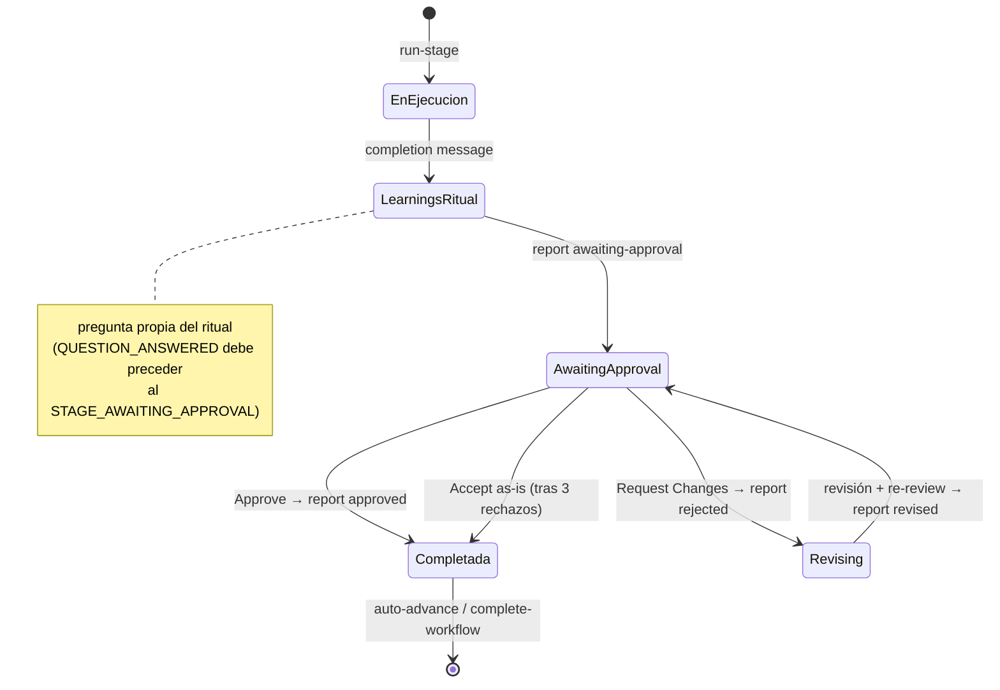
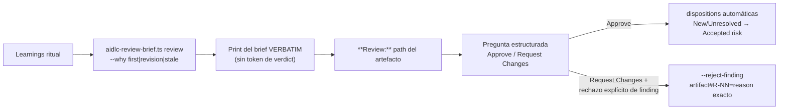

> [Inicio](README) › [Maquinaria](06-maquinaria/README) › **Ciclo de gate**

# El ciclo de gate (aprobación → rechazo → revisión)

El gate es la unidad de control humano de AI-DLC. Cada etapa (salvo las 3 de inicialización) sigue esta coreografía, que el engine audita evento a evento.

## El flujo completo



| Estado | Checkbox | Evento |
|---|---|---|
| En ejecución | `[-]` | — |
| Learnings ritual (turno propio) | `[-]` | `QUESTION_ANSWERED` |
| Gate abierto | `[?]` | `STAGE_AWAITING_APPROVAL` |
| Rechazado / revisando | `[R]` | `GATE_REJECTED` + `STAGE_REVISING` |
| Completado | `[x]` | `GATE_APPROVED` + `STAGE_COMPLETED` |

## Las reglas duras

1. **HARD STOP**: al presentar el gate, el conductor TERMINA su turno. Ninguna tool antes de que el humano escriba su elección. El gate no se infiere, no se auto-aprueba, no se salta.
2. **Opciones exactas**: Construction/Operation = 2 opciones (Approve / Request Changes). Ideation/Inception pueden añadir una 3ª (añadir etapa saltada). El texto de `[next stage]` sale VERBATIM del campo `next_stage` del directive — jamás inferido.
3. **User input literal**: `--user-input "<elección exacta>"` — nunca parafrasear ni meter feedback ahí (el feedback va en `--reason`). Aprobar mapea findings New/Unresolved → `Accepted risk`.
4. **Revision loop**: rejected registra feedback → revisión inmediata si el feedback ya nombra qué cambiar; pregunta estructurada con opciones del artefacto solo si es genuinamente ambiguo. Si la revisión cambió un produces[] y hay reviewer: re-review ANTES de `revised`. El learnings ritual NO se re-corre (una vez por etapa).
5. **Escape hatch**: tras 3 rechazos en la misma etapa, la 4ª gate ofrece **Accept as-is** ("Archive current version and move on") — se registra en el audit y completa la etapa.
6. **Respuesta no coincidente**: citar breve, re-presentar la MISMA pregunta con TODAS las opciones, terminar turno. Sin receipts, sin writes. Un "Other" del harness es discusión, no checkpoint resuelto.
7. **Sensores blocking**: si el report de gate se rechaza por findings o evaluación fallida, el gate NO abre. Opciones: Fix findings / Override blocking sensors — y el override exige el par decision/answer con HUMAN_TURN. **Autonomous jamás ofrece override**: unattended runs halt loudly.

## El gate con reviewer



## El gate de summary consolidado (preguntas, no lifecycle)

Antes de generar artefactos, el checkpoint persistido: "Does this all look correct before I generate the artifact?" con opciones Looks correct / Request changes, sin letras, con `aidlc-log.ts decision/answer --checkpoint summary-confirmation`. Un Request changes aquí abre la pregunta "What should change?" y END TURN — jamás revisar antes del feedback humano. Cada ciclo appendea una sección sibling `## Requested Changes Feedback`.

## Progreso tras aprobar

Formato exacto (dos formas):

```
Progress: 13/33 overall | 3/7 IDEATION stages complete. Next: Approval & Handoff
Progress: 5/8 in-scope stages complete (7/33 overall) | 2/3 CONSTRUCTION. Next: Build & Test
```

`S` = total in-scope del scope activo (de `aidlc-utility.ts scope-table`, nunca tablas a mano). Contar completadas Y saltadas de la fase actual.

## Qué nunca pasa por un gate

- Autonomía inferida de un "go with recommended" previo (vale por ESA etapa).
- Override de sensor blocking sin par decision/answer + HUMAN_TURN.
- Respuestas no-coincidentes tratadas como checkpoint resuelto.
- Gates abiertos y respondidos en el mismo turno del conductor.
