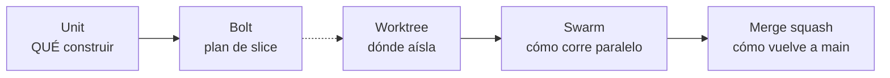
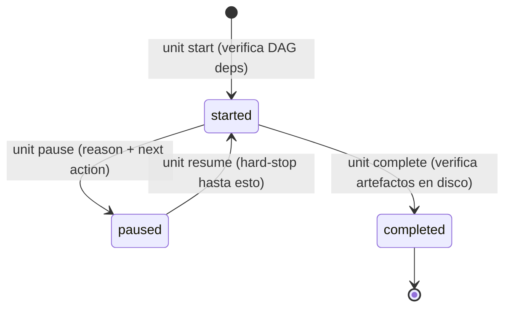
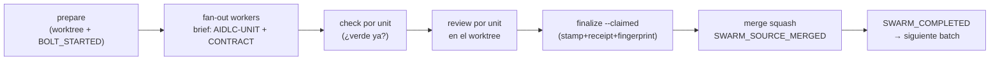

> [Inicio](README) › [Maquinaria](06-maquinaria/README) › **Ciclos de vida**

# Ciclos de vida: Units, Bolts, worktrees y autonomía

Construction tiene su propio conjunto de ciclos de vida anidados. Esta página los desambigua: amplía la tabla del glosario §9.

## Los 5 conceptos (y sus diferencias)

| Concepto | QUÉ es | Dónde nace | Dónde vive |
|---|---|---|---|
| **Unit of Work** | El QUÉ: pieza independientemente implementable | Units Generation (2.7) | `unit-of-work-dependency.md` (DAG) |
| **Bolt** | El slice de entrega planeado: Units + DoD + confidence hypothesis | Delivery Planning (2.9) | `bolt-plan.md` (planeamiento; el walk stage-major no lo usa como boundary) |
| **Worktree** | El aislamiento git de una Unit bajo swarm | `aidlc-swarm.ts prepare` | `<path>/bolt-<slug>` branch |
| **Swarm** | La ejecución autónoma paralela | `invoke-swarm` directive | Referee del engine + audit |
| **Batch paralelo** | Units sin dependencias mutuas, runtime | Del DAG, re-computado | `SWARM_COMPLETED` lo cierra |

## El walking skeleton y la escalera

1. **Stance**: org → team → project (la statement no-vacía más específica manda; el marker de bolt-plan es advisory).
2. **Gate del skeleton**: el primer in-scope Construction EXECUTE stage siempre presenta gate — cubre esa etapa en las Units settled.
3. **Ladder** (una vez): "Continue autonomously" / "Gate every Bolt" → `Construction Autonomy Mode` en state (AUTONOMY_MODE_SET). En autonomous: se saltan los gates restantes de Construction (salvo halt-and-ask, rung 4 del loop-back y el settle gate, que el conductor auto-aprueba) y se habilita swarm. En unit-major el swarm jamás dispara (la walk es serial).

## El ciclo del Unit (receipts de lifecycle)

- **Una Unit activa a la vez** por stage (start se niega si otra está abierta).
- **Receipt mode sticky**: una vez existe cualquier receipt para un stage, todos los intentos posteriores requieren `UNIT_COMPLETED` current-attempt — los artefactos solos ya no settle una Unit.
- **Run floors**: cada receipt amarra el boundary-token del intento (`<event>:<timestamp>#<ordinal>` sobre workflow start/jump/rejection/stage start) — receipts de intentos previos no cuentan; timestamps empate causalmente desordenados → floor AMBIGUOUS determinista que invalida lo viejo.
- **Waves** (stage-major): la directiva trae N entradas per-unit con paths y review_state pre-resuelto — builders concurrentes SIN los verbs start/pause; el completion corre `unit complete --wave` con fan-in del diario al padre y dedup determinista.

## El ciclo del Bolt en swarm

- **Solo code-generation es swarm-eligible** (escribe el workspace compartido): los designs per-unit corren inline/wave.
- **Halt-and-ask ante BOLT_FAILED** siempre (retry en el MISMO worktree / skip con worktree preservado / abort).
- El merge recupera repo/intent de la autoridad durable, consume el Source Commit inmutable y deshabilita hooks ambientales.
- Merge fallido pre-`merge-succeeded`: resolver y reintentar el MISMO merge; post-marker sin evento: cleanup-only.

## El loop-back de Build & Test (rung por rung)

La escalera del Step 9 de build-and-test: (1) ejecutar, (2) clasificar root cause + estimar impacto del fix candidato, (3) elegir halt-and-ask variant, (4) si el bound se agota o no hay fix: halt SIEMPRE. El bound es el ledger (max 3 por intent); un jump humano no cuenta. Re-entry: fix + Modify/Keep determinista + reviews frescos por unidad + Plan Approval re-preguntado. Detalle en el [protocolo de construction](04-protocolos/protocolo-construction).

## Unit-major y team ownership (opt-ins)

- **unit-major** (set en delivery-planning): una Unit cruza todos sus stages antes de la siguiente; gates al final en cascada; sin swarm; claims/publish/pin/land git-nativos para equipos distribuidos (estrategia merge obligatoria; squash/rebase rechazados).
- **`Unit Progress`**: tabla engine-owned que reescribe cada `next` — proyección del DAG + artefactos + receipts + gates; jamás editar a mano.
