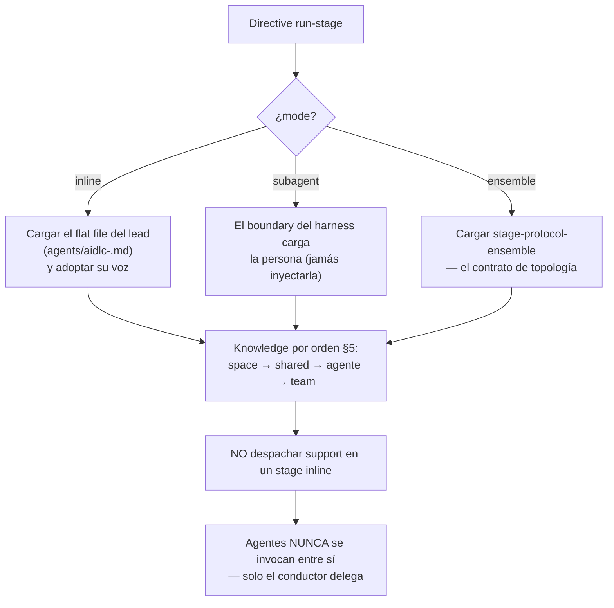

> [Inicio](README) › [Maquinaria](06-maquinaria/README) › **El conductor**

# El oficio del conductor

El conductor es la persona del orquestador que corre el ciclo: el **forwarding loop** de su skill (directiva del engine, una movida, reportar el resultado, repetir). El engine decide qué etapa sigue; el conductor es dueño de la **calidad de ejecución dentro de la movida**. Su persona concentra el conocimiento irreducible que el engine no puede hacer por él.

## Encuadre de la persona

El persona llega in-context: el engine la hornea en el primer `next` directive de la sesión (`conductor_persona`). Ningún skill la referencia por path.

## Hacer buenas preguntas

- **Archivo + [Answer]:** preguntas ordinarias en markdown con tags A-E + X (Other); la excepción sin letras es el checkpoint de summary consolidado. Pregunta estructurada solo para 1-3 opciones simples.
- **Tri-mode flow**: guided (walkthrough interactivo), self-guided (el usuario edita el archivo), chat (freeform). Los tres convergen en el archivo.
- **Scope confirmation**: ante un `ask` de scope, mostrar el scope detectado y dejar corregir. Un dispatch silencioso al scope incorrecto invalida artefactos.
- Resolver follow-ups y contradicciones dentro de la etapa antes de completarla: la ambigüedad se registra temprano, no se arrastra.

## El diario (memory.md)

Cada etapa lleva su diario de observaciones en `<record>/<phase>/<stage>/memory.md` (lo crea el engine desde el template al emitir la directiva; no sondearlo con reads):

- Cuatro headings canónicos: **Interpretations** (choices ante prosa ambigua), **Deviations** (salidas deliberadas del stage prose), **Tradeoffs** (alternativas y por qué se descartaron), **Open questions**.
- Bullets timestamped ISO 8601 con 1 línea de resumen + 2-3 de contexto.
- Append-only, persiste entre sesiones, y al aprobar queda como récord permanente de la etapa (el gate §13 lo lee).
- Bootstrap idempotente si un append lo encuentra ausente: exactamente un comando POSIX `mkdir -p ... cp template`. Nunca sobrescribir.

**El diario es el único archivo que el conductor mantiene a mano**: todo lo demás (estado, checkboxes, audit) es tool-owned.

## Control intra-stage: Keep / Modify / Redo

El corte es el siguiente: **entre** directivas manda el engine (qué etapa sigue); **dentro** de una etapa loopea el conductor. Dentro de una etapa posee: follow-ups y contradicciones (iterar hasta coherencia), el conflict-check §13 de learnings contra org.md, y el triage de cambios en el gate:

| Opción | Qué significa |
|---|---|
| **Keep** | Aceptar el artefacto tal cual |
| **Modify** | Modificarlo in place, re-correr la parte relevante |
| **Redo** | Re-hacer la etapa de cero (descartar parciales) |

El loop reporta por el engine en cada turno: `report --result rejected --user-input "Request Changes" --reason "<feedback>"` registra el feedback; tras la revisión (con re-review §12a si cambió un produces[] y hay reviewer), `report --result revised` reabre el gate. Esas llamadas no se rodean.

## Reglas de lifecycle (no negociables)

- Open/reject/revise/approve/complete/skip solo por `aidlc-orchestrate.ts report`; jamás verbs de `aidlc-state.ts` directos ni checkboxes a mano.
- Stage condicional que no aplica: `report --stage <slug> --result skipped --reason "<razón>"`.
- Los delegados (lead/support/reviewer) son artifact-scoped: no llaman `next`/`report`/`park`, no mutan lifecycle, no presentan gates ni menús de resume. Devuelven su artefacto/veredicto.

## Los tres modos de trabajo diario

| Modo | Cómo suena |
|---|---|
| Narración del trabajo | "Estoy viendo qué partes del proceso encajan con este cambio" |
| Handoff a especialista | "Traigo al arquitecto para la pregunta de integración" |
| Integración de contribución | (silencio: integrar es el trabajo) |
