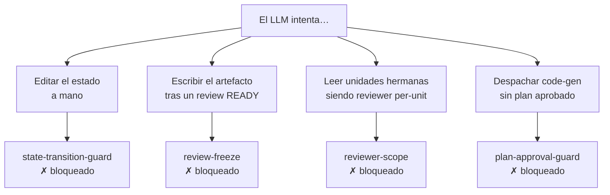

> [Inicio](README) › [Maquinaria](06-maquinaria/README) › **Hooks**

# Los 17 hooks

Los hooks son el refuerzo determinista del protocolo en el harness: interceptan eventos del runtime (sesión, tools, prompts) y garantizan invariants que el LLM no puede violar aunque "quiera". Byte-identical entre harnesses (misma TS fuente, distintos adapters).

## El catálogo funcional

| Hook | Evento del harness | Qué hace |
|---|---|---|
| `aidlc-session-start.ts` | SessionStart | Emite SESSION_STARTED/RESUMED y restaura contexto del workflow |
| `aidlc-session-end.ts` | SessionEnd | Emite SESSION_ENDED con el motivo |
| `aidlc-record-human-turn.ts` | UserPromptSubmit + PostToolUse(AskUserQuestion) | **HUMAN_TURN**: la prueba determinista de presencia humana que gates y receipts exigen |
| `aidlc-continue-workflow.ts` | Stop | **Forwarding loop**: distingue pregunta humana genuina pendiente (blank `[Answer]:`) de stage abandonado — y empuja a continuar |
| `aidlc-write-audit-log.ts` | PostToolUse (Write/Edit) | Auto-registra ARTIFACT_CREATED / ARTIFACT_UPDATED |
| `aidlc-log-subagent.ts` | SubagentStop | Registra SUBAGENT_COMPLETED con el identity marker del subagente |
| `aidlc-validate-state.ts` | PreCompact | Valida aidlc-state.md antes de compactar; escribe el breadcrumb `.aidlc-recovery.md` |
| `aidlc-state-transition-guard.ts` | PreToolUse | Bloquea edits directos de estado/checkboxes fuera del engine |
| `aidlc-review-freeze.ts` | PreToolUse | **REVIEW_FREEZE_BLOCKED**: rechaza writes a produces[] entre el receipt terminal y el gate |
| `aidlc-reviewer-scope.ts` | PreToolUse | **REVIEWER_SCOPE_BLOCKED**: rechaza que un reviewer per-unit lea unidades hermanas |
| `aidlc-plan-approval-guard.ts` | PreToolUse | **PLAN_APPROVAL_BLOCKED**: rechaza dispatch/mutación sin plan aprobado vigente |
| `aidlc-run-sensors.ts` | PostToolUse / gate | Dispara los sensores importados según fire_on |
| `aidlc-sync-workflow-state.ts` | PostToolUse (TaskUpdate) | Parsea `[slug]` del activeForm y sincroniza estado (checkbox, fase, agente) |
| `aidlc-rebuild-stage-graph.ts` | Session/config | Reconstruye el grafo compilado tras upgrades/plugins (self-heal) |
| `aidlc-deliver-stage-rules.ts` | Directivas | Entrega el bundle load-steering de reglas del active-space |
| `aidlc-fold-usage.ts` | Post | Agrega uso de sesión (costos/turnos) para el skill session-cost |
| `aidlc-statusline.ts` | Render | Muestra stage/progreso en la barra de estado del harness |
| `review-freeze-command.ts` | CLI | Consulta de la política freeze vía comando (misma lógica) |

## Los 4 guards que hacen innegociable el protocolo

La tesis de diseño: no confiar en que el LLM obedezca el protocolo; el runtime lo hace obligatorio. Cada guard emite su fila de auditoría (los `*_BLOCKED`) con tool, target, stage y unit: la desviación intentada queda registrada, no solo prevenida.

## El Stop hook como heartbeat

`aidlc-continue-workflow.ts` es el motor del forwarding loop: cuando el conductor termina su turno sin haber preguntado algo con `[Answer]:` pendiente en el archivo, el hook lo interpreta como stage abandonado y lo empuja a seguir. Por eso el protocolo exige escribir toda pregunta pendiente en el archivo antes de parar a esperar, en cada modo (guided/self-guided/chat). La señal de human-wait legible por máquina también viene del par decision/answer de `aidlc-log.ts`.

## Instalación por harness

| Harness | Formato |
|---|---|
| Claude Code | `.claude/settings.json` (hooks nativos) |
| Kiro IDE | `.kiro/hooks/aidlc-*.json` (v2) + `.kiro.hook` legacy |
| Kiro CLI | Agent-JSON hooks |
| Codex | `.codex/hooks.json` + trust previo (sin trust, no corren) |
| Cursor | `.cursor/hooks.json` (adapter merge) |
| opencode | `.opencode/` plugin adapter (engine en `.aidlc/`) |
| Copilot | `.github/` workflows/prefijados aidlc + trust de folder |
