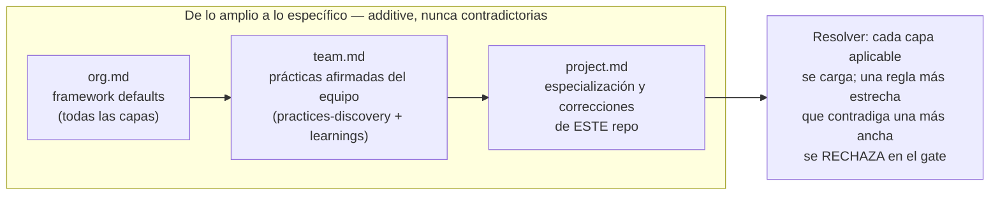
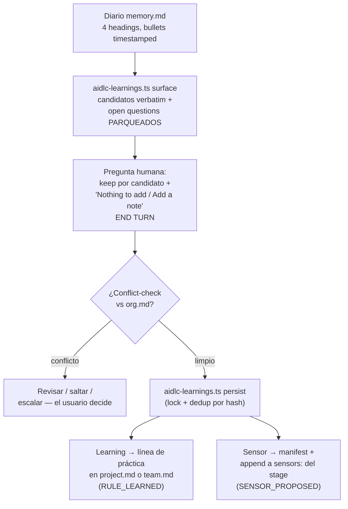
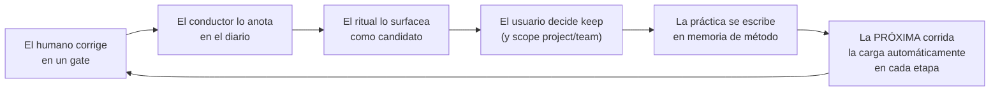

> [Inicio](README) › [Maquinaria](06-maquinaria/README) › **Memoria y aprendizaje**

# Memoria de método y el bucle de aprendizaje

AI-DLC tiene **dos sistemas de conocimiento**: el del framework (metodología, que se distribuye con la dist) y el del equipo (memoria de método, user-managed). El segundo es donde vive el self-learning: las correcciones humanas se convierten en reglas que la próxima corrida carga automáticamente.

## Las 3 capas de memoria (estricto-aditivas)

| Archivo | Contenido | Headings típicos |
|---|---|---|
| `org.md` | Defaults del framework: trunk-based development, squash-merge de Bolts, posture de testing por scope, deploy-on-merge | Way of Working, Walking Skeleton, Testing Posture, Deployment, + secciones de correcciones |
| `team.md` | Lo que el equipo AFIRMÓ en practices-discovery (2.2) + promociones de learnings | Way of Working, Testing Posture (con Methodology/Ordering explícitos), Code Style, Forbidden, Mandated, Corrections |
| `project.md` | Learnings project-tier: prácticas de este repo | Corrections, Testing Posture, Forbidden, + lo que el routing cree |

Se cargan por el resolver en cada etapa (capa 1 del knowledge-loading order §5). No hay tier org escribible: el widen va project→team, sin org path.

## El learnings ritual §13 (una vez por etapa, antes del gate)

Puntos finos del ritual:

- **Tool-as-actor**: detección, routing y escritura son deterministas (la tool); el juicio es del usuario (keep / heading / scope).
- **El usuario nunca elige el heading destino**: elige el heading del DIARIO (Interpretation/Deviation/Tradeoff/Open question); el conductor ruta por fit (testing → Testing Posture, prohibición → Forbidden, general → Corrections).
- **Open questions nunca se instalan**: son research parqueado.
- **Dedup por hash de contenido** (`<!-- cid:... -->` con SHA-256 del texto): un crash no duplica; textos distintos no colisionan.
- **La pregunta es obligatoria** aunque no haya candidatos, y va en su propio turno, antes de abrir el gate.
- **Sensor = instalación dos-escrituras**: manifest en `sensors/` + append del id al `sensors:` del stage (la única mutación sancionada de frontmatter). Ambas writes en una transacción con lock.

## Por qué los stage files son inmutables

1. Los upgrades del framework a un stage file conflictarían con ediciones de runtime.
2. El mismo stage corre en muchos proyectos. Mutar el body deriva la metodología en direcciones incompatibles por proyecto.

El harness (rules, learnings, sensors) está diseñado para **componer**: muchas adiciones pequeñas acumulan sin conflicto. Los bodies permanecen inmutables.

## El ciclo completo del auto-aprendizaje

Ese es el argumento central del repo, citando a Fowler: *"when issues recur, feedforward and feedback controls should be improved"*. Cuando los problemas se repiten, se mejoran los controles feedforward y feedback.

## Exclusiones de la memoria de método

- El diario `memory.md` por etapa: récord permanente de esa etapa (lo lee el §13), sin función como sistema de reglas.
- El audit: historial de eventos (qué ocurrió), sin indicación de acciones futuras.
- El knowledge de equipo (`spaces/*/knowledge/`): documentación de dominio del equipo. Se carga después de la memoria, por persona.
