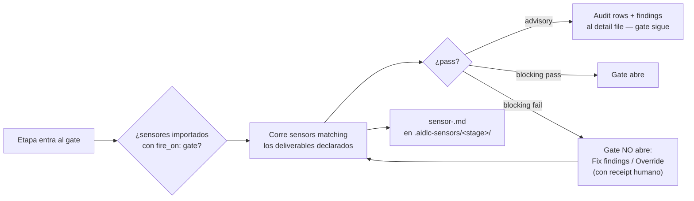

> [Inicio](README) › [Maquinaria](06-maquinaria/README) › **Sensores**

# Los 6 sensores

Un sensor es un **check determinista** que un stage importa en su frontmatter `sensors:`. Solo los sensores importados por la etapa son elegibles de correr. Cada manifest declara match glob, comando, budget de tiempo, `fire_on` y `default_severity`.

## El catálogo

| Sensor | Categoría | fire_on | Match | Qué verifica |
|---|---|---|---|---|
| `claim-sources` | document-provenance | gate | `**/{aidlc-docs,intents}/**` | Que las afirmaciones de los artefactos citen sus fuentes (provenance): cada claim rastreable a input confirmado |
| `required-sections` | document-shape | gate | `**/{aidlc-docs,intents}/**` | Que el output tenga los H2 requeridos (default: ≥2) o los del template resuelto (misma resolución team→framework que el artefacto) |
| `upstream-coverage` | document-shape | gate | `**/{aidlc-docs,intents}/**` | Que la prosa del output REFERENCIE cada artefacto del `consumes:` declarado — se ve qué upstreams informaron el output |
| `traceability` | document-traceability | (write/gate) | `**/traceability.json` | Validación elemento a elemento: cobertura upstream, targets downstream, huérfanos derivados (FR/US/AC/U/BR) |
| `linter` | code-quality | (write) | `**/*.{ts,js}` | Corre el linter del proyecto sobre el código tocado |
| `type-check` | code-quality | (write) | `**/*.{ts,tsx}` | Corre el type-checker (tsc) sobre el código tocado |

## Advisory vs blocking

| Modo | Comportamiento |
|---|---|
| **advisory** (default actual) | Emite su fila de auditoría y findings — NO detiene el gate. Los findings informan al humano |
| **blocking** (gate) | Exige pass VERIFICADO para abrir el gate: findings, evaluación no disponible, output malformado o timeout RECHAZAN la entrada hasta arreglar o pasar el override humano |

- Los findings se escriben a `<record>/.aidlc-sensors/<stage-slug>/<sensor>-<fire-id>.md`. Ese detail file sirve para corregir y re-correr.
- **Autonomous no puede override un sensor blocking**: unattended runs halt loudly.
- `fire_on: write` corre durante writes coincidentes y **permanece advisory en esta release**, incluso si el manifest declara blocking.
- El sensor aprendido (§13): manifest project-tier con `matches:` glob, bound al stage via append al import list. Corre desde el compile de la próxima corrida.

## Sensores por etapa (del stage graph compilado)

Las etapas de ideation/inception suelen declarar el trío documental: `claim-sources`, `required-sections`, `upstream-coverage`. Reverse-engineering añade `traceability`-shaped checks en su cadena. Construction per-unit declara los tres documentales + traceability en los designs. Los stages de operation son más ligeros (required-sections + upstream-coverage típicamente).

## Template resolution (el anti-drift)

`required-sections` verifica el output contra la misma resolución de template que el artefacto debió seguir: (1) team override `spaces/<space>/memory/templates/X.md` → (2) default del framework (si shipea) → (3) prose del stage. La forma producida y la forma chequeada no pueden divergir: el sensor y el artefacto leen el mismo archivo.
