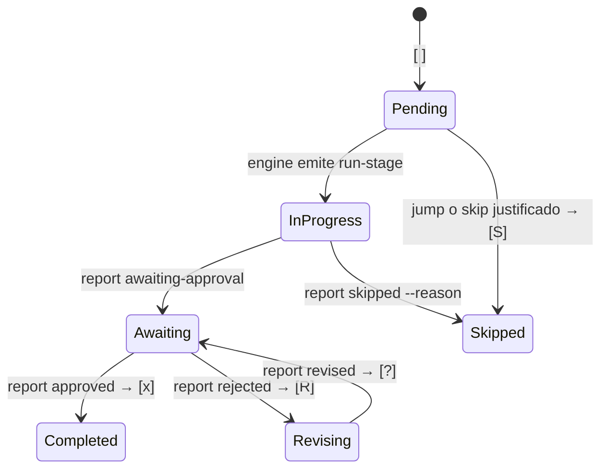

> [Inicio](README) › [Maquinaria](06-maquinaria/README) › **Sistema de estado**

# El sistema de estado (aidlc-state.md)

El archivo de estado es el **cursor oficial del workflow**: dónde estamos, qué está hecho, qué falta. Lo escribe el engine. El conductor jamás edita checkboxes ni llama verbs de lifecycle a mano (el hook state-transition-guard bloquea las escrituras directas).

## Anatomía completa (template v8)

| Sección | Campos | Quién la escribe |
|---|---|---|
| **Project Information** | Project (preview de una línea), Project Description Source (`project-description.json` — el JSON exacto), Project Type (Greenfield/Brownfield), Scope, Start Date, State Version (8), Active Agent, Worktree Path, Bolt Refs, Practices Affirmed Timestamp | Init + engine |
| **Scope Configuration** | Stages to Execute / to Skip (con razones), Depth, Test Strategy | Init + cambios auditados |
| **Workspace State** | Project Root, Languages, Frameworks, Build System | Workspace detection |
| **Execution Plan Summary** | Total Stages, Completed, In Progress | Derivado por engine |
| **Runtime State** | Revision Count, Unit Ownership (solo/team), Unit Gate Rhythm (per-stage/unit-end) | set-construction-iteration / unit verbs |
| **Phase Progress** | Por fase: Pending / Active / Verified / Skipped | Engine |
| **Stage Progress** | Un heading por fase + una fila checkbox por etapa compilada: `- [ ] slug — EXECUTE/SKIP: reason` | Engine |
| **Unit Progress** | Tabla unit × stages (solo en team + unit-major) — proyección derivada del DAG, reescrita en cada `next` | Engine (jamás a mano) |
| **Current Status** | Lifecycle Phase (READY/INITIALIZATION/.../OPERATION), Current Stage, Next Stage, Status, Construction Autonomy Mode (unset/autonomous/gated), Last Updated | Engine |
| **Session Resume Point** | Last Completed Stage, Next Action, Pending Artifacts | Engine |

## El vocabulario de checkboxes

- `[S]` queda excluido de los conteos de progreso (ni total ni done) y es preservado por el routing (nunca se reescribe como completado).
- Un skip condicional exige pin de la etapa activa + razón no vacía; las pendientes solo se saltan por composición o jumps explícitos `--stage/--phase`.
- El salto `[-]` → `[x]` directo está prohibido: no se salta el estado intermedio.

## Quién escribe qué (campo por campo)

Los campos `- **Field**: value` tienen dueños de tool: `aidlc-orchestrate.ts report` (lifecycle), `aidlc-utility.ts scope-change/config-change` (config), `aidlc-bolt.ts set-autonomy` (modo de construcción), `aidlc-state.ts unit *` (receipts per-unit). Las escrituras de bookkeeping son **silenciosas** (tools CLI con read-modify-write atómico), nunca Edit/Write de harness (así se evitan diffs innecesarios).

## Derivación y autoridad

- El template declara la FORMA; el engine enumera las etapas del **grafo compilado + rejilla de scope**. El template no hardcodea stages a mano.
- Vistas autoritativas generadas: `aidlc-utility.ts stage-table` (grafo) y `scope-table` (rejilla).
- **Unit Progress** es proyección pura: DAG + cobertura de artefactos + receipts + gate events. Una edición humana se sobreescribe y jamás cambia routing.
- La detección de corrupción: el PreCompact hook valida la estructura; el breadcrumb `.aidlc-recovery.md` + [recovery](04-protocolos/protocolo-recovery) reconstruyen desde evidencia de artefactos si hace falta.

## Dónde vive

`aidlc-state.md` en la raíz del record del intent activo: `aidlc/spaces/<space>/intents/<intent>/aidlc-state.md`, junto a `project-description.json` y los shards `audit/*.md`. Commiteado (viaja con git); los cursores per-usuario (`active-space`, `active-intent`) quedan untracked.
