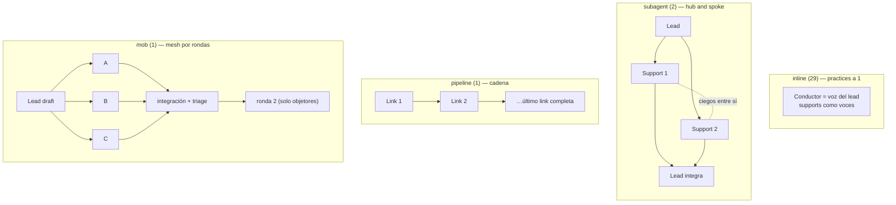

> [Inicio](README) › [Maquinaria](06-maquinaria/README) › **Topologías**

# Topologías de ensemble (cómo colaboran los agentes)

El `mode` del directive es la **topología de comunicación** de la etapa: quién habla con quién. La presencia de support_agents no la determina; la manda el engine en la directiva. Ver también el [protocolo de ensemble](04-protocolos/protocolo-ensemble).

## Las 4 topologías (29 / 2 / 1 / 1)

| | inline | subagent | pipeline | mob |
|---|---|---|---|---|
| **Quién corre** | El conductor con la persona del lead | Lead + supports despachados (Task) | Links despachados en orden | Lead + TODOS los supports en paralelo |
| **Quién ve qué** | Todo (misma sesión) | Supports: draft del lead; NO se ven entre sí | Cada link: todo lo upstream | Todos: el draft; no las contribuciones de hermanos |
| **Contributions** | No | Sí, con identity marker | No (avanzan el artefacto) | Sí, con Positions AGREE/OBJECT |
| **Evidencia de completion** | — | Contribution files completos | PIPELINE_LINK_COMPLETED por repo por link | Contribution files + disenso manejado |
| **Etapa** | 29 etapas | practices-discovery, code-generation | reverse-engineering | user-stories |

## El contrato quién-ve-qué (la invariante)

En un harness sin capacidad de dispatch paralelo, subagent y mob corren **secuenciales con briefs idénticos**: cada participante sigue viendo solo lo que la topología le otorga. La invariante es la topología del conocimiento, no la concurrencia.

## El modelo de escritura

En toda topología despachada: **cada quien escribe su propio trabajo** (contribution file con primera línea identity-marker `**Collaborator:** <agent-slug>`); el lead solo edita los `produces[]`. En pipeline no hay contributions: los links avanzan el artefacto directamente, con receipt por link (`aidlc-log.ts link`) antes del siguiente dispatch, reanudando desde `directive.pipeline.completed` si la sesión murió.

## El NOT-READY en ensemble

Un reviewer NOT-READY re-invoca al **LEAD solo** con los findings: el room (o la cadena) no se vuelve a convocar. Los findings son defectos del artefacto, y el artefacto es del lead. El loop de reparación es ping-pong lead↔reviewer. En pipeline, cada link retorno es leído por el conductor antes del siguiente dispatch.

## Los handoffs en voz humana

Las frases fijas del ensemble (el narration del directive no alcanza dentro de la etapa): "Let me bring in the [trade] on [question]", "The [first trade] takes a look first, then the [next trade] builds on what comes back", "Getting the [trade] and [trade] to weigh in on this together". Y al integrar hay silencio: integrar es el trabajo.
