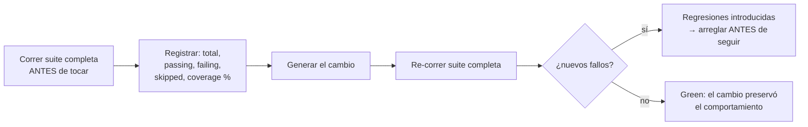

> [Inicio](README) › [Knowledge](07-knowledge/README) › **Brownfield safeguards**

# Safeguards brownfield

Para cualquier stage que modifique código o infraestructura existente, estos safeguards aplican automáticamente. Son la respuesta estructurada de AI-DLC al mayor riesgo del trabajo incremental: romper lo que funcionaba.

## La matriz de safeguards

| Safeguard | Qué hace | Cuándo |
|---|---|---|
| **Blast Radius Analysis** | Identifica archivos/componentes afectados y sus dependientes downstream | Antes de code generation (3.5) |
| **Diff Preview** | Muestra los cambios exactos propuestos antes de aplicarlos | Antes de cualquier modificación |
| **Test Baseline** | Corre la suite existente ANTES de cambiar — establece el baseline | Antes de code generation (3.5) |
| **Test Validation** | Re-corre la suite DESPUÉS — confirma que nada se rompió | Tras code generation, en build-and-test (3.6) |
| **Impact Analysis** | Documenta APIs/componentes/dependencias afectados | En reverse engineering (2.1) y code generation (3.5) |
| **Rollback Plan** | Documenta cómo deshacer si hace falta | Antes de deployment (4.3) |

## Blast Radius (template)

1. Listar todos los archivos que cambiarán.
2. Por archivo: imports/consumidores, archivos de test, referencias de configuración.
3. Clasificar impacto: **low** (cambio aislado) · **medium** (2-3 dependientes) · **high** (cross-cutting).
4. Presentar el resumen de impacto al usuario ANTES de proceder.

## Test Baseline (protocolo)

## Las reglas operativas derivadas

- **In-place, jamás duplicar**: code-generation en brownfield modifica los archivos existentes — crear `ClassName_modified.java` está explícitamente prohibido.
- **Source manifest**: cada unidad declara los paths que crea/modifica/borra (`source-manifest.json`) — el blast radius queda auditable y el reviewer verifica diferencialmente contra el manifest.
- **El rollback runbook se escribe en 4.1** (deployment-pipeline) ANTES de la ejecución 4.3 — no se improvisa.
- **RE-first**: un brownfield entra por reverse-engineering (routing de state-init 0.3) — no se cambia lo que no se ha modelado en CodeKB.
- **Suite existente verde** es floor en los scopes incrementales (bugfix/refactor/security-patch/poc/workshop): el cambio no puede romper el baseline.
