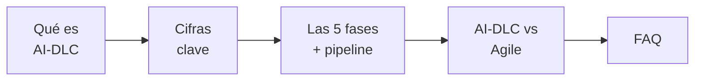
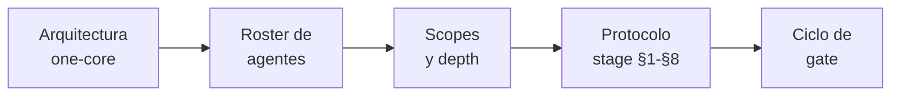

> [Inicio](README) › [Anexos](08-anexos/README) › **Rutas de lectura**

# Rutas de lectura de este desglose

~100 páginas organizadas de lo general a lo particular. Tres profundidades según tu rol y tu tiempo. Las migas de pan y el sidebar te mantienen siempre ubicado.

## Ruta rápida — "¿qué es esto y para qué?" (~15 min)

1. [Qué es AI-DLC](00-vision/que-es-aidlc) — el problema, los 7 principios, mob model.
2. [Cifras clave](00-vision/cifras-clave) — los 12 números y por qué importan.
3. [Las 5 fases](01-fases/README) — el pipeline completo con sus fronteras.
4. [AI-DLC vs Agile](08-anexos/aidlc-vs-agile) — qué cambia realmente.
5. [FAQ](08-anexos/faq) — respuestas rápidas de adopción.

**Para**: ejecutivos evaluando la metodología, managers decidiendo adopción.

## Ruta media — "¿cómo funciona y cómo lo adapto?" (~45 min)

La rápida más:

6. [Arquitectura one-core](00-vision/arquitectura-one-core) — zonas del repo, harnesses, spaces/intents/records.
7. [Roster de agentes](03-agentes/README) + 2-3 fichas de tu interés.
8. [Scopes](05-scopes/README) — la rejilla 11×33 y cómo elegir.
9. [Protocolo stage](04-protocolos/protocolo-stage) — foco en §1 gates, §3 preguntas, §8 depth.
10. [Ciclo de gate](06-maquinaria/ciclo-de-gate) — la coreografía de aprobación.
11. Una fase que te interese: [ideation](01-fases/fase-1-ideacion), [inception](01-fases/fase-2-inception) o [construction](01-fases/fase-3-construccion).

**Para**: tech leads, arquitectos decidiendo rollout, configuradores de scopes.

## Ruta profunda — "lo voy a usar/extender" (4-6 h)

La media más, en orden:

12. [Las 33 fichas de etapa](02-etapas/README) — o al menos las 12 core: 1.1, 2.1, 2.2, 2.3, 2.4, 2.6, 2.7, 2.9, 3.5, 3.6, 4.3, 4.7.
13. Los [8 protocolos](04-protocolos/README) — construction, ensemble, reviewer y swarm con calma.
14. La [maquinaria](06-maquinaria/README) completa: conductor, estado, auditoría, memoria, sensores, hooks, topologías, ciclos de vida.
15. [Knowledge](07-knowledge/README): principios, verificación y brownfield safeguards.
16. Anexos: [matriz etapas×agentes](08-anexos/matriz-etapas-agentes), [matriz de artefactos](08-anexos/matriz-artefactos), [errores frecuentes](08-anexos/errores-frecuentes).
17. Terminar con el [glosario](00-vision/glosario) como repaso.

**Para**: engineers que van a correrlo diario, portarlo a un harness nuevo o escribir plugins.

## Por si solo tienes 3 preguntas

| Tu pregunta | La página |
|---|---|
| "¿Cómo evito que la IA arrastre sin control?" | [ciclo-de-gate](06-maquinaria/ciclo-de-gate) + [protocolo reviewer](04-protocolos/protocolo-reviewer) |
| "¿Cómo elige qué etapas correr?" | [scopes](05-scopes/README) + [composer](03-agentes/aidlc-composer-agent) |
| "¿Cómo aprende de mis correcciones?" | [memoria-y-aprendizaje](06-maquinaria/memoria-y-aprendizaje) |
| "¿Cómo retomo una sesión caída?" | [protocolo recovery](04-protocolos/protocolo-recovery) |
| "¿Cómo funciona la generación paralela?" | [ciclos-de-vida](06-maquinaria/ciclos-de-vida) + [swarm](04-protocolos/protocolo-swarm) |
