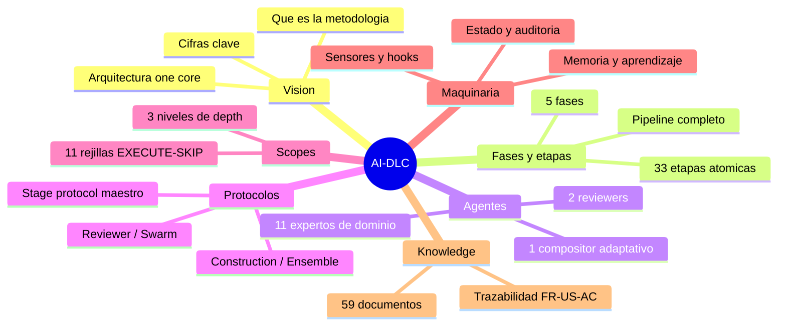

# AI-DLC

**AI-DLC** (AI-Driven Development Life Cycle) es la metodología de AWS que convierte agentes de IA en **workflows de ingeniería verificables y auto-correctivos**, con un humano aprobando cada gate. Este sitio es un desglose completo y atómico de su implementación nativa multi-harness (repo `awslabs/aidlc-workflows` v2.7.1, 2.0 GA): de lo general a lo particular, en una red de markdowns hiperenlazados.

## Cómo navegar

- **Sidebar izquierdo**: índice jerárquico completo (de lo general a lo particular).
- **Migas de pan**: cada página abre con `Inicio › Área › Subárea › Página` clicable.
- **Búsqueda**: caja arriba a la derecha; busca en los ~100 documentos.
- **Diagramas Mermaid**: se renderizan de forma automática; cada uno incluye su contexto en prosa.

## Rutas de lectura

| Ruta | Para | Recorrido | Tiempo |
|---|---|---|---|
| **Rápida** | Ejecutivos / evaluadores | [Qué es AI-DLC](00-vision/que-es-aidlc) → [Cifras clave](00-vision/cifras-clave) → [Fases](01-fases/README) → [AI-DLC vs Agile](08-anexos/aidlc-vs-agile) | ~15 min |
| **Media** | Leads / arquitectos | Rápida + [Arquitectura](00-vision/arquitectura-one-core) → [Agentes](03-agentes/README) → [Scopes](05-scopes/README) → [Protocolo stage](04-protocolos/protocolo-stage) | ~45 min |
| **Profunda** | Engineers que lo van a usar/extender | Todo: 33 fichas de etapa, 8 protocolos, maquinaria completa y anexos con matrices | 4-6 h |

## Mapa del desglose (7 áreas)

| Área | Contenido | Páginas |
|---|---|---|
| [00 · Visión](00-vision/README) | Qué es, arquitectura one-core-many-harnesses, cifras, glosario | 4 páginas |
| [01 · Fases](01-fases/README) | Las 5 fases del ciclo + pipeline de 33 etapas | 6 páginas |
| [02 · Etapas](02-etapas/README) | Ficha atómica de cada una de las 33 etapas | 34 páginas |
| [03 · Agentes](03-agentes/README) | El roster de 14 agentes con su participación real | 15 páginas |
| [04 · Protocolos](04-protocolos/README) | Los 8 protocolos que gobiernan la ejecución | 9 páginas |
| [05 · Scopes](05-scopes/README) | 11 scopes adaptativos + depth + test strategy | 12 páginas |
| [06 · Maquinaria](06-maquinaria/README) | Conductor, estado, auditoría, memoria, sensores, hooks, topologías | 10 páginas |
| [07 · Knowledge](07-knowledge/README) | Base de conocimiento de 59 docs + trazabilidad | 4 páginas |
| [08 · Anexos](08-anexos/README) | Matrices cruzadas, comparativas, FAQ, errores | 7 páginas |

## Los 12 números que definen AI-DLC

| # | Número | Qué es |
|---|---|---|
| 1 | **5 fases** | Initialization → Ideation → Inception → Construction → Operation |
| 2 | **33 etapas** | Pasos discretos, cada uno con gate humano |
| 3 | **14 agentes** | 11 expertos de dominio + 2 reviewers + 1 compositor |
| 4 | **11 scopes** | Rejillas EXECUTE/SKIP que adaptan el workflow |
| 5 | **3 depths** | Minimal / Standard / Comprehensive |
| 6 | **8 protocolos** | El contrato de ejecución (stage protocol + 7 módulos) |
| 7 | **91 eventos de auditoría** | En 22 categorías — trazabilidad enterprise |
| 8 | **6 sensores** | Checks verificables en gates y writes |
| 9 | **17 hooks** | Refuerzo determinista del protocolo |
| 10 | **48 herramientas TS** | El motor determinista (engine) |
| 11 | **59 knowledge docs** | Metodología de dos niveles |
| 12 | **7 harnesses** | Claude Code, Kiro IDE/CLI, Codex, Cursor, opencode, Copilot |

---

> **Fuentes primarias**: repo `awslabs/aidlc-workflows` (rama `main`, v2.7.1) — la zona core del repo como fuente única de verdad · [Blog AWS AI-DLC](https://aws.amazon.com/blogs/devops/ai-driven-development-life-cycle/) · [Paper de definición del método](https://prod.d13rzhkk8cj2z0.amplifyapp.com/) · [Especificación 2.0 (PDF)](https://github.com/awslabs/aidlc-workflows/blob/main/assets/AI-DLC-Workflows-2.0-Specification.pdf)
>
